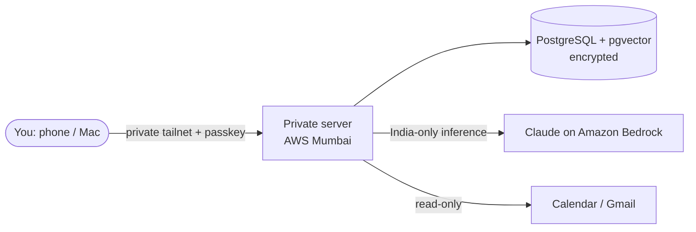

# Weekend 2.0 — Personal AI Assistant

A private, single-owner AI assistant. Chat or talk to it from your phone or Mac; it remembers what you tell it and reads your calendar and email when you allow it. Built for **one person only**, with data kept in India wherever possible.

> **Status:** Phase 0: requirements and architecture. No application code yet.
> Design: [docs/DESIGN.md](docs/DESIGN.md) · Status tracker: [tracking/Weekend2.0_Tracker.xlsx](tracking/Weekend2.0_Tracker.xlsx)

---

## What it will do

| Feature | Description | Phase | Status |
|---|---|---|---|
| Text chat | Ask questions and get streamed answers | 1 | ⚪ Planned |
| Voice | Hold to talk; the answer is spoken back | 2 | ⚪ Planned |
| Phone app | Installable web app (PWA) with passkey login | 2 | ⚪ Planned |
| Reminders | Push notifications to your phone | 2 | ⚪ Planned |
| Memory | Remembers facts; you can view, edit, export and delete them | 3 | ⚪ Planned |
| Connectors | Read-only Google Calendar, then Gmail | 3+ | ⚪ Planned |

## Design at a glance (provisional)



- **No public endpoint:** the server has no inbound ports and is reachable only over your tailnet.
- **Privacy rules P1–P10:** see [DESIGN.md §4](docs/DESIGN.md#4-privacy-rules-in-plain-words-p1p10).
- **Budget:** ≤ ₹5,000 a month (about USD 52). The current estimate for text-only is about ₹4,440 ([DESIGN.md §21](docs/DESIGN.md#21-cost-model)).
- All six major decisions (hosting, model, cloud, storage, auth, mobile) are **still open**: [DESIGN.md §6](docs/DESIGN.md#6-decisions-register-d1d6).

## Repository layout

```
weekend2.0/
├── README.md            # this file
├── tracking/           # Weekend2.0_Tracker.xlsx — phases, tasks, decisions, issues, cost
└── docs/
    ├── README.md        # how the docs are organised and updated
    ├── DESIGN.md        # main design document (architecture, components, cost, roadmap)
    ├── adr/             # one Architecture Decision Record per decision (D1–D6)
    └── diagrams/        # exported diagrams (Mermaid lives inline in DESIGN.md)
```

Planned, added in Phase 1 and later: `src/weekend/` (Python app), `tests/`, `infra/` (Terraform `modules/` + `envs/`), `ansible/`, `.github/workflows/`.

## Prerequisites (planned for Phase 1)

| Tool | Version | Why |
|---|---|---|
| Python | 3.12+ | Application |
| Docker | current | Local Postgres + pgvector |
| Terraform | pinned in Phase 5 | Infrastructure |
| Ansible | pinned in Phase 5 | Server configuration |
| AWS CLI v2 | current | Deployment (your own credentials; never committed) |
| Tailscale | current | Private access |

## Getting started

Nothing to install yet. To follow the project:
1. Read [docs/DESIGN.md](docs/DESIGN.md), Part A, for the plain-English overview.
2. Check [tracking/Weekend2.0_Tracker.xlsx](tracking/Weekend2.0_Tracker.xlsx) for the current phase and the next step. (Detailed project memory is kept privately, outside this public repo.)

From Phase 1 onwards, this section will hold:

```bash
python -m venv .venv
source .venv/bin/activate
pip install -r requirements.txt
cp .env.example .env        # placeholders only; real secrets live in AWS Secrets Manager
pytest
```

## Configuration

To be defined in Phase 1. Rules decided now:
- No secrets in code, `.env` files in git, Terraform outputs or logs (P4).
- `.env.example` holds placeholders only.

## Testing and CI/CD

Planned: `ruff` → `mypy` → `pytest` → Docker build → Trivy, gitleaks, pip-audit, checkov → gated deploy, using GitHub Actions with AWS OIDC (no stored keys). See [DESIGN.md §18](docs/DESIGN.md#18-cicd).

## Troubleshooting

Not applicable yet.

## Release notes

- Document versions: [DESIGN.md → Document release notes](docs/DESIGN.md#document-release-notes)
- Feature releases: [DESIGN.md §23](docs/DESIGN.md#23-feature-release-notes)

## Author and licence

Nikhil (owner). Private project — all rights reserved, not for redistribution.
