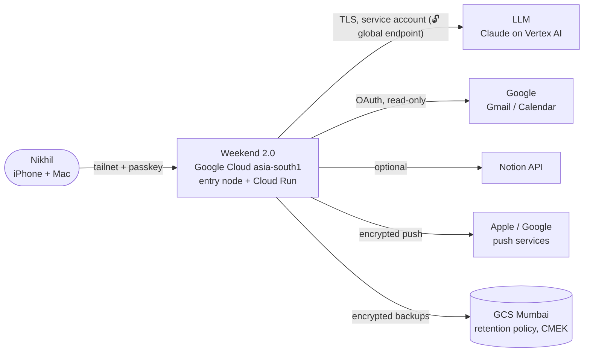
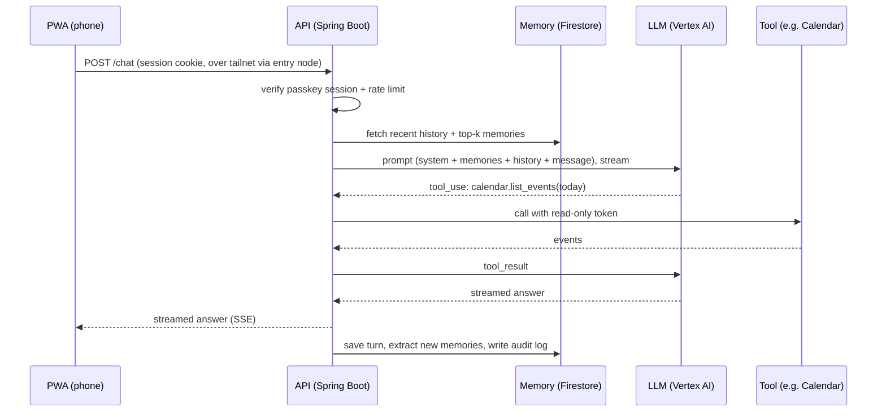
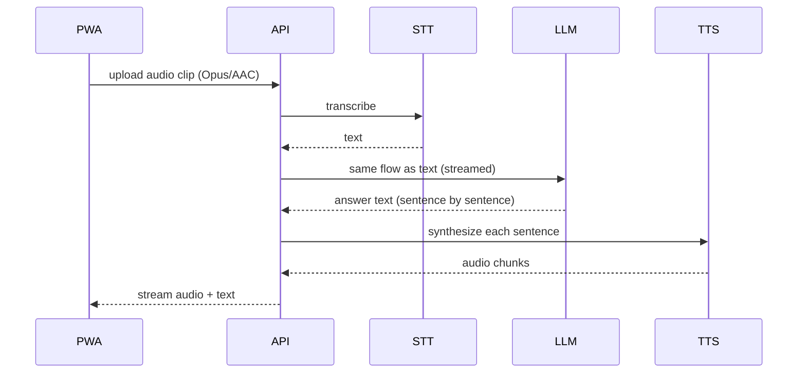
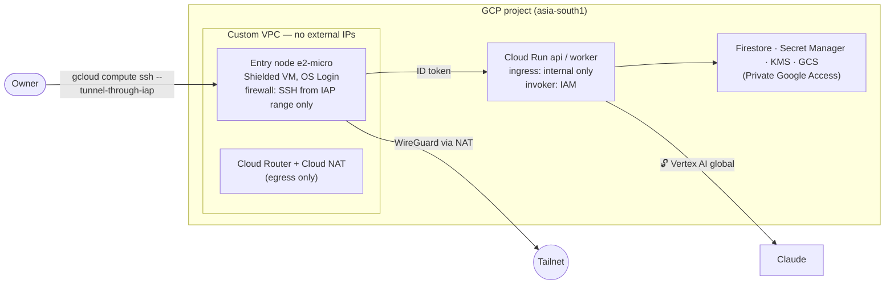

# Weekend 2.0 — Personal AI Assistant: Design Document

> **Doc version:** 0.4.0 (DRAFT) · **Status:** Phase 0 — Requirements & architecture · **Owner:** Nikhil
> **Last updated:** 2026-10-03 (IST) · **Applies to:** prices and versions checked on 2026-10-02/03 · **Cloud:** Google Cloud (D4 decided 2026-10-03)
> **Currency:** USD 1 = INR 96.3 (mid-market, 2026-10-02, [Trading Economics](https://tradingeconomics.com/india/currency)). All INR figures are rounded.

**D4 (cloud) is decided: Google Cloud** ([ADR-0001](adr/ADR-0001-d4-cloud-provider-gcp.md)). **D2 (model) is decided: Claude on Vertex AI, global endpoint, with a copy of every exchange in our database** ([ADR-0002](adr/ADR-0002-d2-model-claude-vertex-global.md)). Every other recommendation is **PROVISIONAL** until the owner decides it. Decisions are made in a fixed order: D1 → D2 → D4 → D5 → D6 → D3 (see §6).

---

## Document release notes

Newest first. Every change to this document adds a row here. Feature releases have their own notes in §23.

| Doc version | Date (IST) | Type | Summary | Sections changed |
|---|---|---|---|---|
| 0.6.0 | 2026-10-07 | Minor | **Persona, focus mode, math, web.** Per-agent persona (humor, truth, focus, efficiency 1–5, search range, approval range) with presets Funny/Disciplined/Work/Browse and moods happy/serious/calm/curious; efficiency picks model, steps, tokens and context; High/Max = focus mode (helmet docks on the chat box). Local exact math tools; web search (MediaWiki) off until a host is allowed (🔓). Owner profile file → pinned memories always in context (🔓 to Vertex). Private brand pack served from a local folder (owner's Iron-Man-style art never committed). High pressure: concurrency guard (503 + Retry-After) and model retries with backoff | 7, 13, 15 |
| 0.5.0 | 2026-10-06 | Minor | **UI v3 and agents.** Home (category tiles, folders, up next); tasks, folders, approvals queue, payments (tracking only, never pays, card numbers refused), agent messages, in-app notifications (P5: 30 days; messages 365 days; P6 export/delete-all cover all of it). Agents: built-in, custom (owner instructions after the fixed rules + conditions), a config agent reading the owner's CLAUDE.md, remote agents over weekend-agent/1 (🔓 every message needs approval; allow-listed hosts only; inbound token stored as a hash). Brand: one colour (Electric Blue #1D5BFF) and an original helmet mascot (Marvel's Iron Man design not used: trademark/copyright, public repo). Browser E2E tests in CI | 13, 15 |
| 0.4.0 | 2026-10-03 | Major | **D2 decided: Claude on Vertex AI (global)**; data exit accepted; **copy of every LLM exchange kept in Firestore asia-south1** (new requirement). CI/CD built: infra-ci (fmt, tflint, plan → PR), infra-cd (apply -auto-approve, free resources only, owner-approved), app-ci, app-cd. One generic Terraform root (`infra/stack`); env values on env branches; short-lived credentials (deployer impersonation, no keys). Stale FastAPI references corrected to Spring Boot | Header, 5.2, 5.3, 6, 7.3, 7.4, 18 |
| 0.3.0 | 2026-10-03 | Minor | **Application language: Java 17 + Spring Boot 4.1** (owner's choice; replaces the Python/FastAPI plan). Application core built on `Feature_code` (`app/`): agent loop, tool plugins, memory, reminders, retention, P6 export/delete, signed sessions, PWA UI | 7.2, 18 |
| 0.2.1 | 2026-10-03 | Patch | Dev is **free by default**: CMEK, entry node and NAT are switches that default to off ("on hold"); dev project `weekend2-0` created; billing account found closed | 21.4 |
| 0.2.0 | 2026-10-03 | Major | **D4 decided: Google Cloud** (AWS dropped). Architecture moved to Cloud Run + Firestore + Vertex AI + e2-micro tailnet node; new 🔓 exit (Claude via Vertex global endpoint); cost re-estimated (≈ ₹2,784/month prod incl. GST); Terraform rewritten for GCP. Earlier AWS content is superseded. | Header, 1, 2, 4, 5, 6, 7, 8, 9, 10, 12, 13, 14, 16–22, 24, App. A, C |
| 0.1.3 | 2026-10-02 | Patch | Owner-exported FigJam diagrams added as images (docs/diagrams/: .jpg images, .svg exports, .mmd sources) | 5, 9, 16 |
| 0.1.2 | 2026-10-02 | Patch | FigJam board with 5 architecture diagrams (system, text flow, voice flow, network, data model) | 5 |
| 0.1.1 | 2026-10-02 | Patch | Owner set the budget: ₹5,000/month (Q-1 closed). Budget fit added to cost totals. | 3.1, 21.4, 21.5, 24 |
| 0.1.0 | 2026-10-02 | Initial draft | Base plan: architecture, component designs, cost model, roadmap. All decisions open. | All |

**How to update this document**
1. Change only the sections you need. Bump the version: **major** for an architecture change or a new decision, **minor** for a new feature section or major content, **patch** for fixes and price refreshes.
2. Add a row to the table above.
3. When a feature ships, add an entry to §23 and update that component's *Change history* table.
4. Re-check every price older than 90 days before you rely on it. Each cost row carries its own "checked on" date.

---

## Contents

- **Part A — Read me first:** 1 What it is · 2 Glossary · 3 Goals and sizing · 4 Privacy rules in plain words
- **Part B — Architecture:** 5 System overview · 6 Decisions register
- **Part C — Components:** 7 Chat assistant · 8 Voice · 9 Database and storage · 10 Query, memory and retrieval · 11 SMS and messaging · 12 Connectors · 13 Plugins and tools · 14 Authentication and access · 15 Mobile interface
- **Part D — Platform:** 16 Infrastructure · 17 Servers and compute · 18 CI/CD · 19 Monitoring, audit and backups · 20 Threat model
- **Part E — Cost:** 21 Cost model
- **Part F — Delivery:** 22 Roadmap · 23 Feature release notes · 24 Open questions and risks
- **Appendices:** A Lessons from Weekend v1 · B Component template · C Sources

---

# PART A — READ ME FIRST

## 1. What Weekend 2.0 is

**In one sentence:** a private AI assistant, like a personal ChatGPT, that only Nikhil can use. It answers by text or voice from his phone or Mac, remembers what he tells it, and can read his email and calendar when he allows it. His data stays under his control and inside India wherever possible.

**A day in the life (target experience)**
- **07:30** — On the phone, Nikhil taps the Weekend app (an icon on the home screen) and says: *"What's on my calendar today, and did Google Cloud send any billing alerts?"* Weekend turns his speech into text, checks the calendar and Gmail connectors, and answers out loud in about 3 seconds.
- **13:00** — He types: *"Remember that the staging DB password rotates on the 15th."* Weekend stores a **memory**. It stores the fact, not the password itself: secrets never go into memory.
- **18:00** — He gets a notification: *"Reminder: staging DB rotation is in 2 days."*
- **22:00** — On the Mac he asks: *"Summarise what I worked on this week."* Weekend searches its own memory and conversation history and writes a summary.

**What it is not**
- Not a product for other people: there is no sign-up page and no second user.
- Not an autonomous agent that acts on its own. Anything that changes something (sending email, deleting data) asks Nikhil first.
- Not a place to store passwords or keys. Secrets live in a secrets manager (P4).

**How the pieces fit, in plain words**
Think of Weekend as a small private office:
- The **front door** is the phone app. Only Nikhil's devices have a key: a private network called a *tailnet*, plus a *passkey*.
- The **receptionist** is the *API server*. It checks who is at the door and passes the request on.
- The **brain** is a large language model (LLM). It reads the request and decides what to answer or which tool to use.
- The **filing cabinet** is the database. It holds conversations, memories and settings, encrypted.
- The **ears and mouth** are speech-to-text and text-to-speech.
- The **assistants with keys to other rooms** are *connectors* and *tools*: Gmail, Calendar and so on. Each one has the narrowest key that works.

---

## 2. Glossary

| Term | Plain meaning | Where it matters |
|---|---|---|
| **LLM** (large language model) | The AI "brain" that reads text and writes answers, for example Claude or Gemini. | §7 |
| **Token** | A piece of a word; about 4 English characters. LLMs are priced per million tokens (MTok). | §21 |
| **Context / context window** | Everything the LLM sees in one request: instructions, history, retrieved memories. | §7, §10 |
| **Prompt caching** | Re-using an unchanged start of a prompt so it is billed at about 10% of the normal input price. | §21 |
| **Tool calling / function calling** | The LLM asks *your code* to run a named function (such as `calendar.list_events`) and uses the result. | §7, §13 |
| **Agent loop** | Repeat until done: the LLM thinks, calls tools, reads the results, then answers. | §7 |
| **STT** (speech-to-text) | Turns audio into text, for example Whisper or Google Cloud Speech-to-Text. | §8 |
| **TTS** (text-to-speech) | Turns text into spoken audio, for example Kokoro or Google Cloud Text-to-Speech. | §8 |
| **Embedding** | A list of numbers that represents the *meaning* of a text. Similar meanings give similar numbers. | §10 |
| **Vector search** | Finding stored texts whose embeddings are closest to the question's embedding. Firestore has built-in vector (KNN) search. | §9, §10 |
| **RAG** (retrieval-augmented generation) | Search memory first, then give the best matches to the LLM so it answers with your facts. | §10 |
| **Connector** | Code that reads from (or writes to) an outside service, such as Gmail, using OAuth. | §12 |
| **OAuth scope** | The exact permission a connector asks for, for example "read calendar" but not "delete calendar". | §12 |
| **Plugin / tool** | A capability the agent can use. In Weekend 2.0, tools are fixed, reviewed code. Nothing is downloaded at runtime. | §13 |
| **Passkey (WebAuthn)** | Password-less login tied to your device and its Face ID or Touch ID. It can't be phished. | §14 |
| **Tailnet / Tailscale** | A private WireGuard network between your own devices. The server has no public door. | §14, §16 |
| **Cloud Run** | Google's serverless containers: runs only while handling a request, scales to zero. | §16, §17 |
| **Firestore** | Google's serverless document database (Native mode), billed per operation with a free daily quota. | §9 |
| **Vertex AI** | Google's AI platform; serves Claude and Gemini models. | §7 |
| **Workload Identity Federation (WIF)** | Lets GitHub Actions call Google Cloud with short-lived tokens instead of stored keys. | §18 |
| **PWA** (progressive web app) | A website you "Add to Home Screen" that behaves like an app, including notifications. | §15 |
| **Cloud KMS / CMEK** | Key Management Service / customer-managed encryption key: the encryption key you control. | §9 |
| **IaC / Terraform** | Infrastructure as code: cloud resources described in files and created repeatably. | §16 |
| **DLT** (India) | TRAI's mandatory registry for anyone sending commercial SMS in India. | §11 |
| **P1–P10** | The project's ten privacy rules (§4). | everywhere |
| **D1–D6** | The six big decisions (§6). | everywhere |
| **🔓 data exit** | A point where data leaves the owner's control, for example a hosted LLM API. | §5, §21 |

---

## 3. Goals, non-goals and sizing

### 3.1 Goals
| # | Goal | Measure |
|---|---|---|
| G1 | Chat with the assistant from phone and Mac, any time | Works on iPhone/Android PWA and Mac browser |
| G2 | Voice in and voice out | Speech round trip ≤ 3 s at p50 (target) |
| G3 | It remembers what the owner tells it, and can forget it | Owner can view, export and delete any memory (P6) |
| G4 | Read-only access to the owner's email and calendar | Connectors with minimum scopes |
| G5 | Only the owner can use it | P1 tests pass; no public unauthenticated endpoint |
| G6 | Low, predictable cost | Monthly cost ≤ **₹5,000 (≈ USD 52)**, with budget alerts |
| G7 | Data stays in India where possible | Every exit flagged 🔓 and approved |

### 3.2 Non-goals (v1 of Weekend 2.0)
Multi-user accounts · public website · marketplace plugins · autonomous actions without confirmation · SMS marketing · voice cloning of real people.

### 3.3 Sizing for one person
These are **assumptions to confirm** (Q-2). They drive every cost and server number below.

| Dimension | Low | Expected | Heavy |
|---|---|---|---|
| Chat turns per day | 30 | 100 | 300 |
| Input tokens per turn (instructions + history + memories) | 3,000 | 3,000 | 3,000 |
| Output tokens per turn | 400 | 400 | 400 |
| Voice minutes per day (talking + listening) | 5 | 30 | 90 |
| Concurrent users | 1 | 1 | 1 |
| Peak requests per second | < 1 | < 1 | ~ 2 |
| Data growth in year 1 | < 1 GB | ~ 2 GB | ~ 5 GB |
| Availability target | Best effort | 99% per month (about 7 h downtime allowed) | 99% |

**What this means:** one person never needs auto-scaling clusters, Kubernetes or multi-region failover. One small server, or serverless functions, is enough. The main cost driver is the LLM, not the servers.

---

## 4. Privacy rules in plain words (P1–P10)

| # | Rule | In plain words | How Weekend 2.0 meets it (planned) |
|---|---|---|---|
| P1 | Single-owner access | Only Nikhil's devices and face or finger can get in. | Tailnet (device layer) + passkey (person layer); no public port |
| P2 | TLS 1.2+ everywhere | Everything travelling over a network is encrypted. | WireGuard on the tailnet + HTTPS; TLS to Google APIs and Cloud Run |
| P3 | Encrypted storage | Data on disk is unreadable without your key. | Firestore, Secret Manager, GCS backups and the VM disk encrypted with a customer-managed Cloud KMS key (CMEK) |
| P4 | Secrets in a manager | No passwords or API keys in code or files. | Google Secret Manager; service-account identities, no JSON keys |
| P5 | Keep only what's needed | Delete old data automatically. | Retention table (§9.4) with scheduled cleanup |
| P6 | View, export, delete | You can see everything, download it, and wipe it. | `/export` and `/delete` endpoints plus a runbook, tested |
| P7 | Flag data exits | Know every place data leaves your control. | 🔓 flags in every section and in §5.4 |
| P8 | Tamper-resistant logs | A record of who did what, which can't be quietly edited. | Append-only audit collection (hash chain) + copy in a GCS bucket with a retention policy |
| P9 | Small attack surface | As few open doors as possible. | Cloud Run internal-only ingress; VM without external IP; only IAP-range SSH; tailnet only |
| P10 | Encrypted, tested backups | Backups exist and a restore has actually been tried. | Firestore daily backups + nightly encrypted export to GCS; quarterly restore drill |

---

# PART B — ARCHITECTURE

## 5. System overview

> **Editable diagrams (FigJam):** https://www.figma.com/board/pMvZioGximavxDcsD14Ee9 — the Mermaid diagrams are the source of truth (also kept as `.mmd` files in `docs/diagrams/`); the `.jpg`/`.svg` images there are exports of the board. Re-export them when the board changes.

> This shows the **reference design on Google Cloud** (D4 decided 2026-10-03; D1 shape **E2-GCP** in §17 is PROVISIONAL): serverless Cloud Run + Firestore in Mumbai, reached only through a tiny tailnet entry node. ⚠️ The `.jpg`/`.svg` images still show the old AWS design and are archived in `docs/diagrams/archive-aws/`; the Mermaid below is current. Re-export from FigJam after the board is updated.

### 5.1 Context: who talks to what


### 5.2 Containers: what runs where
```mermaid
flowchart TB
  subgraph Phone/Mac
    pwa[PWA app<br/>chat UI, mic, push]
  end
  subgraph GCP["Google Cloud project (asia-south1)"]
    subgraph VPC["VPC: no external IPs, Cloud NAT egress"]
      node[Entry node e2-micro<br/>tailscaled + HTTPS proxy<br/>adds ID token]
    end
    api[Cloud Run: api<br/>internal ingress, IAM invoke<br/>Spring Boot (Java 17): auth, chat, voice, memory, agent core]
    worker[Cloud Run: worker<br/>retention, export, reminders]
    fs[(Firestore Native<br/>CMEK, vector search)]
    sm[(Secret Manager<br/>CMEK)]
    gcs[(GCS backups)]
    sched[Cloud Scheduler + Cloud Tasks]
  end
  pwa -- WireGuard --> node -- ID token --> api
  api --> fs
  api -- secrets --> sm
  api -- enqueue reminder --> sched
  sched -- OIDC --> worker
  worker --> fs
  worker --> gcs
  api -- tools --> conn[Connectors<br/>Gmail, Calendar, Notion]
  api -- "Vertex AI (🔓 global)" --> llm[(Claude)]
```

### 5.3 How a request flows

**Text message**


**Voice message** (push-to-talk)


**Latency budget for voice (target, p50):** upload 0.2 s + STT 0.6 s + first LLM sentence 1.2 s + first TTS chunk 0.4 s + network 0.2 s ≈ **2.6 s** until the first sound. These are design targets, measured in Phase 2. `Not verified`.

### 5.4 Data-exit map (P7)
| # | Exit | Data | To | Default |
|---|---|---|---|---|
| X1 | LLM inference | Prompts, history, memories, tool results | Google Vertex AI, Claude **global** endpoint (may be processed outside India) | Needed. 🔓 flagged in §7; in-India alternative = Gemini in asia-south1 (D2) |
| X2 | Hosted STT/TTS (if chosen) | Voice audio, spoken text | Google Cloud Speech-to-Text / Text-to-Speech, or none if local | Decided in Phase 2 (§8) |
| X3 | Push notifications | Encrypted payload + metadata | Apple APNs / Google FCM | Content-free notifications by default (§11) |
| X4 | Tailscale coordination | Device keys, device names, IPs (not traffic) | Tailscale Inc. (or self-hosted Headscale) | 🔓 flagged in §14 |
| X5 | Connectors | Queries to Google/Notion | Google, Notion | Read-only, approved one by one |
| X6 | HTTPS certificates | Machine name in public CT logs | Let's Encrypt CT logs | Use a non-identifying machine name |
| X7 | Research / web tools | Search queries | Search provider | Off by default |
| X8 | Design diagrams | Architecture design only (no secrets or personal data) | Figma Inc. | Approved by owner 2026-10-02 |

---

## 6. Decisions register (D1–D6)

**Order is strict:** D1 → D2 → D4 → D5 → D6 → D3. Later decisions stay `PROVISIONAL — depends on D#` until the earlier ones are decided. Each decision gets an ADR in `docs/adr/`.

| ID | Decision | Options | PROVISIONAL recommendation | Status | Details |
|---|---|---|---|---|---|
| D1 | Hosting | Serverless + tailnet entry node (E2-GCP) · Private VM · Local Mac · Hybrid | **E2-GCP: Cloud Run + Firestore + e2-micro tailnet entry node, asia-south1** | Open (PROVISIONAL) | §17 |
| D2 | AI model | Claude on Vertex AI (global) · Gemini on Vertex AI (asia-south1) · Claude API · open-weights local | **Claude Haiku 4.5 (default) + Sonnet 5 (hard tasks) on Vertex AI, global endpoint**; data exit accepted; copy of every exchange in Firestore asia-south1 ([ADR-0002](adr/ADR-0002-d2-model-claude-vertex-global.md)) | **Decided 2026-10-03** | §7 |
| D4 | Cloud provider | AWS · GCP · none | **Google Cloud** — ~~AWS~~ SUPERSEDED (by owner decision 2026-10-03, [ADR-0001](adr/ADR-0001-d4-cloud-provider-gcp.md)) | **Decided 2026-10-03** | §16 |
| D5 | Storage / hardware | Firestore · Cloud SQL Postgres · Postgres on a VM · local disk | **Firestore (Native, `(default)`, CMEK) in asia-south1; GCS for backups** — ~~PostgreSQL on EBS~~ SUPERSEDED (by D4 = GCP) | Open — depends on D1 | §9 |
| D6 | Authentication | Passkey · passkey + tailnet · OIDC (Google) · mTLS | **Tailnet (device) + passkey (person)**, recovery codes offline | Open — depends on D1 | §14 |
| D3 | Mobile interface | PWA · native app · messaging bridge (Telegram/WhatsApp) · voice-only | **PWA** | Open — decided last | §15 |

---

# PART C — COMPONENTS

> Each component uses the same template (Appendix B), so features can be added one at a time.

## 7. Chat assistant (agent core)

**Status:** ⚪ Design · **Phase:** 1 · **Decision:** D2

### 7.1 Plain-English summary
The chat assistant is the "brain plus manager". It takes your message, gathers the relevant context (recent chat, memories), asks the LLM for an answer, lets the LLM use approved tools, and streams the answer back.

### 7.2 How it works
1. **Build the context:** system instructions (who Weekend is, its rules) + up to 8 retrieved memories (§10) + the last N turns + your message.
2. **Pick a model (routing):** simple requests go to a fast, cheap model. Long or complex reasoning goes to a stronger model. Start with a rule-based router (message length, keywords, "think harder" toggle) and move to LLM-based classification only if needed.
3. **Agent loop:** the LLM may return `tool_use`. The server runs the tool from the allow-list (§13) and sends back `tool_result`. Maximum 5 tool steps per turn.
4. **Confirmation gate:** any tool marked `writes=true` (send email, create event) **pauses** and asks you "Do it? yes/no" in the app.
5. **Stream** the answer to the app with Server-Sent Events.
6. **After the turn:** save it, extract candidate memories (§10), write an audit entry (§19).

**Tech (owner decision 2026-10-03):** **Java 17 + Spring Boot 4.1.1** on Cloud Run, Anthropic Java SDK 2.68.0 with the Vertex backend (`anthropic-java-vertex`), Maven, JUnit 6. ~~Python 3.12 + FastAPI~~ SUPERSEDED. Code: [`app/`](../app/README.md). Pinned versions go into `requirements.txt` in Phase 1.

### 7.3 Model options (D2)
Prices are per million tokens (input / output), checked 2026-10-02 on [Anthropic pricing](https://platform.claude.com/docs/en/about-claude/pricing).

| Option | Model(s) | Price USD | Data location | Pros | Cons | P7 |
|---|---|---|---|---|---|---|
| ~~A. Claude on Bedrock, India geo profile~~ (SUPERSEDED by D4 = GCP, 2026-10-03) | Haiku 4.5, Sonnet 5, Opus 5 (`in.anthropic.*`) | Haiku $1/$5 · Sonnet 5 $2/$10 · Opus 5 $5/$25, **+10% regional premium** | Processed in ap-south-1/ap-south-2; not stored ([AWS blog, 2026-09-29](https://aws.amazon.com/blogs/machine-learning/amazon-bedrock-expands-claude-model-availability-to-india-cross-region-inference/)) | Data stays in India; IAM role, no API key (P4); one AWS bill | Newest models (Sonnet 5.5, Opus 5.5) are not in the India profile yet | 🔓 to AWS (India) |
| **A2. Claude on Vertex AI (global endpoint)** | Haiku 4.5 `claude-haiku-4-5@20251001`, Sonnet 5 `claude-sonnet-5`, Opus 5.5 `claude-opus-5-5` | Same list prices as Anthropic; **no premium on the global endpoint** (regional/multi-region +10%) | Dynamic global routing; **no India region** for current Claude models (US/EU multi-region or global only) ([Anthropic, 2026-10-03](https://platform.claude.com/docs/en/build-with-claude/claude-on-vertex-ai)) | Newest models; service-account auth, no API key (P4); one Google bill | Data may leave India | 🔓 to Google (global) |
| **A3. Gemini on Vertex AI, asia-south1** | Gemini Flash / Pro | See §7.3 option C | Processed in Mumbai (`Not verified` per model) | Keeps prompts in India; cheapest | Different model family; re-test prompts and tools | 🔓 to Google (India) |
| B. Claude API (Anthropic, global) | Sonnet 5.5 $2/$10, Opus 5.5 $4/$20, Haiku 4.5 $1/$5 | Standard | Global routing (US-only option at 1.1×; no India option) | Newest models first; prompt caching | Data leaves India; API key to manage | 🔓 to Anthropic (global) |
| C. Gemini API | 2.5 Flash-Lite $0.10/$0.40 · 2.5 Flash $0.30/$2.50 · 3.1 Pro $2/$12 ([third-party summary](https://benchlm.ai/google/api-pricing), `Not verified` on Google's page) | Cheapest | Vertex regional options — `Not verified` for asia-south1 | Very cheap; same Google bill | Different model family; check data-use terms | 🔓 to Google |
| D. Open-weights, local | e.g. Qwen3 14B, Gemma 4 26B A4B (Apache 2.0, per [HF blog](https://huggingface.co/blog/daya-shankar/open-source-llm-models-to-run-locally)) via Ollama | $0 per token | Your hardware | Maximum privacy | Weaker than frontier models; needs a 24–32 GB Mac or a GPU; hardware disclosure (§17.3) | None |

**DECIDED 2026-10-03 (owner, ADR-0002): Option A2**, data exit accepted, with a copy of every exchange in our database (§7.4). ~~PROVISIONAL recommendation~~: Haiku 4.5 handles about 80% of turns, Sonnet 5 about 20%, and Opus only on explicit request. If keeping prompts in India matters more than model choice, pick **A3 (Gemini in asia-south1)**; the model location is one Terraform variable (`vertex_location`). Keep the LLM client behind an interface (`LLMProvider`) so B or D can be swapped in later.

**Price check:** Vertex AI lists Claude at Anthropic's prices on the global endpoint. Confirm Sonnet 5 on [Vertex AI generative AI pricing](https://cloud.google.com/vertex-ai/generative-ai/pricing) before deciding D2. `Not verified` for Sonnet 5 specifically. (The earlier Bedrock price conflict no longer applies.)

**Tokenizer note:** Claude 4.7 and later models use a tokenizer that produces about 30% more tokens for the same text (Anthropic pricing page). The cost model in §21 adds this for Sonnet 5.

### 7.4 Data held, retention, exits
- Held: conversation turns (text), model and token counts per turn, tool calls, and (**D2 requirement, 2026-10-03**) a **copy of every LLM exchange** — model, the redacted request sent to Vertex AI, the reply, tokens, cost, time — in Firestore asia-south1. Same retention as messages (365 days), included in export (P6) and delete-all. Built in `Feature_database` (T-040).
- Retention: conversations 365 days by default (owner-configurable); token and cost metrics 2 years.
- 🔓 **DATA LEAVES OWNER CONTROL**
  - **What:** prompts (message, retrieved memories, recent history, tool results)
  - **To:** Google Vertex AI, Claude **global** endpoint (any Google region with capacity; not limited to India)
  - **Why:** LLM inference
  - **Policy:** data handling is governed by Google Cloud ([Vertex AI data governance / zero data retention](https://cloud.google.com/vertex-ai/generative-ai/docs/data-governance)); request-response logging is off unless enabled. Training-use and retention specifics: `Not verified` — read that page before D2.
  - **Alternative:** Gemini on Vertex AI in asia-south1 (A3), or an open-weights model running locally (Option D)
  - **Owner decision (2026-10-03):** exit accepted; we keep our own copy in India.

### 7.5 Security
- Prompt-injection defence: tool results and connector content are wrapped as *data*, never as instructions. Write-tools always require confirmation.
- Output limits: maximum tokens per turn, maximum tool steps, daily cost cap (stop and notify when exceeded).

### 7.6 Cost
See §21. Expected about **USD 14.5 / ₹1,390 per month** for the LLM (Vertex global endpoint, no regional premium).

### 7.7 Open questions
Q-3: languages: English only, or Hindi/Hinglish too? This affects model and STT choice.

### 7.8 Change history
| Version | Date | Change |
|---|---|---|
| 0.1.0 | 2026-10-02 | Initial design |
| 0.2.0 | 2026-10-03 | D4 = GCP: Claude via Vertex AI (global endpoint, 🔓); Gemini in asia-south1 added as the in-India option |

---

## 8. Voice (speech-to-text and text-to-speech)

**Status:** ⚪ Design · **Phase:** 2 · **Decision:** part of D2/D5

### 8.1 Plain-English summary
"Ears" (STT) turn your speech into text. "Mouth" (TTS) reads the answer back to you. v1 uses **push-to-talk**: hold the button and speak. An always-listening wake word is a later feature, because it costs battery and privacy.

### 8.2 How it works
1. The PWA records audio (Opus in WebM on Android/desktop, AAC/MP4 on iOS) and uploads it when you release the button.
2. The STT engine returns text, with the language detected.
3. The text goes through the normal chat flow (§7).
4. The answer streams back sentence by sentence. Each sentence is sent to TTS and played as soon as it's ready.

### 8.3 Options
| Option | STT | TTS | Cost at 900 min/month | Data location | Licence | Notes |
|---|---|---|---|---|---|---|
| **A. Local (in our own container)** | faster-whisper (CTranslate2 Whisper; Whisper is MIT) | Kokoro 82M (Apache 2.0) | $0 per minute; needs 2–4 GiB RAM and CPU on Cloud Run (or a larger VM); cost `Not verified`, benchmark in Phase 2 | Your project (asia-south1) | MIT / Apache 2.0 | Most private; CPU latency `Not verified` |
| **B. Google Cloud managed** | Speech-to-Text v2, Chirp 3 (~$0.016/min) | Cloud Text-to-Speech (Neural2/Chirp HD voices) | ≈ $14.4 + ≈ $10 = **~$24 (₹2,330)** — `Not verified` | Google; asia-south1 availability per model `Not verified` | Service terms | Same cloud and bill; no extra vendor |
| D. ElevenLabs (evaluation only) | — | Premium voices | Credits | Vendor (`Not verified`) | Vendor terms | Phase 2 trial only, with approval per call |

**Other notes**
- **STT state of the art (2026):** Qwen3-ASR (multilingual), NVIDIA Parakeet TDT (English streaming), Whisper large-v3-turbo (809M parameters, close to large-v3 accuracy) ([Northflank](https://northflank.com/blog/best-open-source-speech-to-text-stt-model-in-2026-benchmarks), [SevenLabs](https://www.sevenlabs.site/blogs/best-open-source-speech-to-text-models-2026)). Whisper handles Indian-accented English and Hindi reasonably well; prompting with names and terms improves accuracy.
- ⚖️ **LICENCE:** **Piper TTS** moved to `OHF-Voice/piper1-gpl` under **GPL-3.0** (the old MIT repository was archived on 2025-10-06) ([source](https://www.cekura.ai/discover/piper-tts)). Prefer **Kokoro (Apache 2.0)**. Avoid Coqui XTTS (CPML, non-commercial).

**PROVISIONAL recommendation:** start Phase 2 with **A (local)**. Benchmark latency on Cloud Run. If p50 is over 3 s, use **B for STT only** and keep TTS local.

### 8.4 Data held, retention, exits
- Raw audio: **not stored** by default (deleted after transcription). An optional debug flag keeps it for 24 h.
- Transcripts are stored as normal chat turns (§7.4).
- Option B → 🔓 flag (voice audio to Google Cloud Speech services).

### 8.5 Change history
| Version | Date | Change |
|---|---|---|
| 0.1.0 | 2026-10-02 | Initial design |
| 0.2.0 | 2026-10-03 | D4 = GCP: AWS voice option replaced by Google Cloud Speech-to-Text / Text-to-Speech |

---

## 9. Database and storage

**Status:** ⚪ Design · **Phase:** 1 and 3 · **Decision:** D5

### 9.1 Plain-English summary
One serverless database, **Firestore (Native mode)** in Mumbai, holds everything structured. Its built-in **vector search** runs "meaning search" for memories. Files (backups, exports) go to a **GCS** bucket. Everything is encrypted with a key you control (CMEK). There is no server to patch and no charge while idle.

### 9.2 Options
| Option | Monthly cost (asia-south1) | Pros | Cons |
|---|---|---|---|
| **A. Firestore Native, `(default)` database, CMEK** | ≈ $0 within the free daily quota (1 GiB stored, 50,000 reads/day); backups ≈ cents | Serverless, scales to zero, vector search built in, no patching | Document model (no SQL joins); export/import for backups |
| B. Cloud SQL for PostgreSQL + pgvector | Smallest shared-core instance runs 24/7 (≈ $10+/month, `Not verified`) + storage | Familiar SQL + pgvector | Always-on cost; patch windows |
| C. PostgreSQL on a VM disk | Bigger VM than e2-micro needed (`Not verified`) | Full control | You run backups and upgrades |
| D. SQLite + sqlite-vec on a local Mac | $0 | Simplest local option | Only fits D1 = local |

**PROVISIONAL recommendation (updated 2026-10-03, D4 = GCP):** A. ~~PostgreSQL 17 + pgvector on EBS~~ SUPERSEDED. Revisit B if relational queries become painful.

### 9.3 Data model (first draft)
Firestore stores these as **collections** (the names below); fields as listed. The single-owner rule is enforced in the app and by IAM.

| Collection | Purpose | Key fields |
|---|---|---|
| `owner` | The single owner record (exactly one row, enforced) | id, display_name, created_at |
| `passkey_credential` | Registered passkeys (public keys only) | id, credential_id, public_key, sign_count, device_label, created_at, last_used_at |
| `session` | Login sessions | id, credential_id, created_at, expires_at, revoked |
| `conversation` | A chat thread | id, title, created_at, archived |
| `message` | One turn | id, conversation_id, role, content, model, tokens_in, tokens_out, cost_usd, created_at |
| `memory` | A remembered fact | id, text, kind (fact/preference/task), source_message_id, embedding (Firestore vector), created_at, expires_at, pinned |
| `reminder` | Scheduled notification | id, text, due_at, recurrence (RRULE), status |
| `connector_account` | Connected services (no tokens here) | id, provider, scopes, secret_ref (Secret Manager secret ID placeholder), status |
| `tool_call` | Tool usage log | id, message_id, tool, args_redacted, result_size, confirmed_by_owner, created_at |
| `audit_log` | Append-only security log (§19) | id, ts, actor, action, target, hash_prev, hash_self |

### 9.4 Retention (P5)
| Data | Default retention | Deletion |
|---|---|---|
| Messages | 365 days | Nightly job; owner can delete any time |
| Memories | Until deleted (pinned) or 180 days if unpinned and unused | Nightly job |
| Raw audio | 0 (not stored) | — |
| Tool-call logs | 90 days | Nightly job |
| Audit log | 2 years (copy in GCS under a retention policy) | Expires by lifecycle rule |
| Backups | Firestore daily backups 7 days; GCS exports 35 daily + 12 monthly | Backup schedule + GCS lifecycle |

### 9.5 Encryption (P3)
- Firestore, Secret Manager, the GCS backup bucket and the prod VM disk: Cloud KMS key `weekend2-<env>/data` (CMEK, yearly rotation). The key ring lives in the bootstrap stack because GCP key rings can't be deleted.
- GCS: uniform bucket-level access, public access prevention enforced, retention policy (not locked) for exports and audit copies.
- Field-level: not needed in v1, because storage is CMEK-encrypted and single-tenant. Revisit in the Phase 4 threat model.

### 9.6 Change history
| Version | Date | Change |
|---|---|---|
| 0.1.0 | 2026-10-02 | Initial design |
| 0.2.0 | 2026-10-03 | D4 = GCP: Firestore (CMEK, vector search) replaces PostgreSQL + pgvector; GCS replaces S3 |

---

## 10. Query, memory and retrieval

**Status:** ⚪ Design · **Phase:** 3

### 10.1 Plain-English summary
This is how Weekend "remembers" and "looks things up". When you say something worth keeping, it saves a short **memory**. When you ask a question, it searches memories and past chats by *meaning* (not just keywords) and gives the best matches to the LLM.

### 10.2 How it works
1. **Write path:** after each turn, a cheap LLM call (Haiku) proposes 0–3 memories: "Owner's staging DB rotates on the 15th". Memories are shown in the app; the owner can edit, pin or delete them. Secrets are filtered out by regex and an LLM check before saving.
2. **Embedding:** each memory is turned into a vector by a **local embedding model inside our own Cloud Run container**, so no data leaves the project. The model choice is made in Phase 3 (candidates: small BGE or E5 models; licence check required, `Not verified`).
3. **Read path:** Firestore vector (KNN) search on `memory.embedding`, plus a keyword filter, merged by rank. Top 8 go into the prompt.
4. **Owner queries:** "What do you know about X?", "Forget everything about Y", "Export my data". These map to tools `memory.search`, `memory.delete`, `data.export`.

### 10.3 Data exits
Embeddings are computed locally, so there is no exit. The retrieved memories are sent to the LLM as part of X1 (§5.4).

### 10.4 Change history
| Version | Date | Change |
|---|---|---|
| 0.1.0 | 2026-10-02 | Initial design |

---

## 11. SMS and messaging (notifications)

**Status:** ⚪ Design · **Phase:** 2 (notifications) · **Decision:** affects D3

### 11.1 Plain-English summary
You want Weekend to *reach you*, with reminders and alerts. SMS looks like the obvious channel, but in India it is heavily regulated and isn't private. This section explains why the recommendation is **app push notifications instead of SMS**.

### 11.2 Findings (researched 2026-10-02)
- **India SMS needs DLT registration.** TRAI requires every sender of commercial or transactional SMS to register an **entity** (a business), **sender IDs** and **every message template** on an operator DLT portal before sending. Unregistered messages are blocked by carriers. Sender IDs now carry a category suffix (-P/-T/-S/-G) ([MessageCentral](https://www.messagecentral.com/sms-guideline/india), [SMSCountry](https://www.smscountry.com/blog/dlt-registration/)). **A private individual cannot practically register.**
- **Cost:** about ₹0.12–0.25 per SMS through Indian providers, plus registration fees (for example a ₹5,900 DLT entity fee cited for Gupshup) ([MetaReach](https://metareachmarketing.com/sms-pricing-comparison-india-2026.php), [CodingClave](https://codingclave.com/blog/gupshup-sms-pricing-india-2026)).
- **Privacy:** SMS is not end-to-end encrypted, and the provider sees every message (P2/P7 fail).
- **Reading SMS:** iOS does not let apps read your SMS inbox, so "assistant reads my SMS" is not possible on iPhone.
- **Telegram bot:** bot chats are **not end-to-end encrypted**; Telegram holds the keys ([Telegram FAQ](https://telegram.org/faq)).
- **WhatsApp Cloud API:** needs a Meta business account; utility messages ₹0.115 each + 18% GST outside the 24 h window ([MyOperator](https://myoperator.com/blog/whatsapp-business-api-pricing-india-2026)); content goes to Meta.

### 11.3 Options
| Option | Privacy | Cost | Effort | Verdict |
|---|---|---|---|---|
| **A. Web Push from the PWA** | Payload encrypted end to end (Web Push encryption); Apple/Google see only metadata | $0 | Low | **Recommended** |
| B. SMS via DLT provider | Poor (plain text) | ₹0.12–0.25/SMS + entity registration | High (needs a business entity) | Not recommended |
| C. Telegram bot | Medium (Telegram can read it) | $0 | Low | Only for content-free pings, if ever |
| D. WhatsApp Cloud API | Medium (Meta) | ₹0.115/msg + GST + BSP fees | Medium | Not recommended |
| E. Email to self | Medium | $0 | Low | Fallback for daily digest only |

**iOS note:** Web Push works on iOS 16.4+ **only when the PWA is added to the Home Screen** ([MagicBell](https://www.magicbell.com/blog/pwa-ios-limitations-safari-support-complete-guide)).

**PROVISIONAL recommendation:** A, with **content-free notifications** by default ("You have 1 reminder"; open the app to read it). Email-to-self as a fallback.

### 11.4 Change history
| Version | Date | Change |
|---|---|---|
| 0.1.0 | 2026-10-02 | Initial design — SMS not recommended |

---

## 12. Connectors

**Status:** ⚪ Design · **Phase:** 3+ (one connector per release)

### 12.1 Plain-English summary
Connectors let Weekend read your other services. Each one is added on its own, starts **read-only**, asks for the smallest permission, and keeps its token in Secret Manager.

### 12.2 Planned connectors (backlog, in suggested order)
| # | Connector | First capability | Scope (minimum) | Auth | Risks / notes |
|---|---|---|---|---|---|
| C1 | Google Calendar | List today's and upcoming events | `calendar.readonly` | OAuth (desktop/installed app) | See the 7-day token issue below |
| C2 | Gmail | Search and read billing/alert emails | `gmail.readonly` (**restricted scope**) | OAuth | 7-day token issue + restricted-scope verification |
| C3 | Notion | Read pages you share with the integration | Internal integration, page-level sharing | Integration token | 🔓 Notion; no expiry, so rotate manually |
| C4 | GitHub | Read issues/PRs of your repos | Fine-grained PAT, read-only, chosen repos | PAT in Secret Manager | — |
| C5 | Google Cloud (own project) | Cost and budget summary | Billing Viewer on the billing account, read only | Service account | No keys |
| C6+ | TBD | — | — | — | Add via the §23 template |

### 12.3 Important finding: Google OAuth "Testing" tokens expire every 7 days
A personal Google Cloud OAuth app that stays in **Testing** status (external user type) gets **refresh tokens that expire after 7 days**. Moving to **Production** with `gmail.readonly` (a *restricted* scope) needs Google verification, including a third-party security assessment, which is impractical for one person ([Unipile](https://www.unipile.com/google-oauth-refresh-token/), [DEV Community](https://dev.to/just_a_side_project/my-oauth-tokens-kept-expiring-every-7-days-and-the-reason-was-a-dropdown-labeled-testing-47ni)).

Options:
1. Re-authorize weekly with a one-tap flow in the app. **PROVISIONAL default for v1.**
2. Use a Google Workspace account with an **Internal** app, which avoids the 7-day limit. This needs a Workspace subscription; cost `Not verified`.
3. Gmail IMAP with an app password: works, but the app password grants broad mailbox access (least-privilege concern).

`Not verified` on Google's own docs; confirm in Phase 3.

### 12.4 Connector rules
- Read-only first. Any write capability (send, create, delete) is a separate release with §4.3-style confirmation in the app.
- Treat all fetched content as **data, not instructions**. This is the prompt-injection boundary.
- Each connector has a kill switch and a "revoke and delete cached data" action.

### 12.5 Change history
| Version | Date | Change |
|---|---|---|
| 0.1.0 | 2026-10-02 | Initial backlog |

---

## 13. Plugins and tools

**Status:** ⚪ Design · **Phase:** 1 (core tools), later (more)

### 13.1 Plain-English summary
A "tool" is a function the LLM may ask the server to run. In Weekend 2.0 **all tools are code in this repository**, reviewed and tested. Nothing is downloaded or installed at runtime. Weekend v1's plugin system downloaded and executed third-party code, which is a big attack surface; it has been dropped.

### 13.2 Tool contract
Every tool declares:
```python
# src/weekend/tools/base.py (sketch)
@dataclass(frozen=True)
class ToolSpec:
    name: str                 # "calendar.list_events"
    description: str          # shown to the LLM
    input_schema: dict        # JSON Schema
    writes: bool              # True → owner confirmation required
    network: list[str]        # allowed hosts, e.g. ["www.googleapis.com"]
    secrets: list[str]        # Secret Manager secret IDs it may read
    timeout_s: int = 15
```

### 13.2a Agents (built 2026-10-06)
Besides tools, the owner can pick an **agent** per chat: Weekend (built in), **custom** agents (owner instructions appended *after* the fixed rules, plus conditions: allowed tools, confirm every tool, think harder, max steps), including one loaded from the owner's CLAUDE.md, and **remote** agents reached over HTTPS (`weekend-agent/1`). Remote calls are a 🔓 data exit: allow-listed hosts only (`WEEKEND_AGENT_ALLOWED_HOSTS`, empty by default), every message needs the owner's yes, and replies are DATA. Built tools: `current_time`, `memory_search`, `memory_save`, `reminder_create`, `task_list`, `task_create`, `agent_delegate`.

### 13.3 v1 tool set
| Tool | writes | Purpose |
|---|---|---|
| `memory.search` / `memory.save` / `memory.delete` | save/delete: yes | §10 |
| `reminder.create` / `reminder.list` / `reminder.cancel` | create/cancel: yes | §11 |
| `time.now` | no | Current IST time |
| `calendar.list_events` | no | C1 |
| `gmail.search` / `gmail.read` | no | C2 |
| `data.export` | no | P6 |

### 13.4 Future: MCP servers
The Model Context Protocol (MCP) can plug external tool servers into an agent. Each MCP server counts as a **plugin**: only vetted, pinned, locally-run servers, each on its own approval. `Not in v1`.

### 13.5 Change history
| Version | Date | Change |
|---|---|---|
| 0.1.0 | 2026-10-02 | Initial design |

---

## 14. Authentication and access (D6)

**Status:** ⚪ Design · **Phase:** 2 · **Decision:** D6

### 14.1 Plain-English summary
Two locks. **Lock 1 (device):** the server is only reachable from devices on your private tailnet, so it can't be found from the internet. **Lock 2 (person):** the app asks for your passkey (Face ID or Touch ID). Both must pass.

### 14.2 Design
- **Network:** Tailscale on the entry node and your devices. A Tailscale grant allows only the owner's devices to reach `tag:weekend:443` (`infra/tailscale/policy.hujson`). The VM has **no external IP**; the API has **internal-only ingress** and accepts only the node's ID token.
- **App:** WebAuthn passkeys, server-side with Duo's `webauthn` Python library ([duo-labs/py_webauthn](https://github.com/duo-labs/py_webauthn)). ⚠️ Install the package named `webauthn` (Duo), **not** the unrelated `py-webauthn` on PyPI. Version pinned in Phase 2 (`Not verified`).
- **Sessions:** HttpOnly, Secure, SameSite=Strict cookie; 12 h idle timeout, 7 days maximum; revoke from the app.
- **Registration lock:** passkey registration is only allowed with a one-time bootstrap code stored in Secret Manager and read by the owner with `gcloud`. There's no public sign-up.
- **Recovery:** 2 passkeys (iPhone + Mac) plus 10 one-time recovery codes printed and stored offline. Phone-loss runbook: remove the device from the tailnet, revoke its passkey, rotate sessions.

### 14.3 Options considered
| Option | Pros | Cons |
|---|---|---|
| **Tailnet + passkey** | No public surface; phishing-resistant | Depends on Tailscale coordination (🔓 X4) |
| Passkey only on a public HTTPS endpoint | No VPN app needed | Public surface (P9); needs WAF/rate limiting |
| Google OIDC login | Easy | Google becomes the gatekeeper (P7) |
| mTLS client certificates | Strong | Painful on iOS |

### 14.4 Tailscale facts (checked 2026-10-02)
- Free **Personal** plan: up to 6 users, unlimited user devices, 50 tagged resources (plans reworked 2026-04-08) ([SSD Nodes](https://www.ssdnodes.com/learn/is-tailscale-free-plan-limits), [CostBench](https://costbench.com/software/business-vpn/tailscale/free-plan/)). `Not verified` on tailscale.com/pricing.
- 🔓 **DATA LEAVES OWNER CONTROL**
  - **What:** device public keys, device names, tailnet IPs, connection metadata. Traffic itself is end-to-end WireGuard.
  - **To:** Tailscale Inc.
  - **Why:** coordination and NAT traversal
  - **Policy:** `Not verified`
  - **Alternative:** self-hosted **Headscale** coordination server
- If you enable Tailscale HTTPS certificates, **machine names are published in public Certificate Transparency logs** ([Tailscale docs](https://tailscale.com/docs/how-to/set-up-https-certificates)). Name the server something generic, like `node-a1`, not `nikhil-weekend`.

### 14.5 Change history
| Version | Date | Change |
|---|---|---|
| 0.1.0 | 2026-10-02 | Initial design |
| 0.2.0 | 2026-10-03 | D4 = GCP: Cloud Run internal ingress + entry node without external IP; bootstrap code via Secret Manager |

---

## 15. Mobile interface (D3 — decided last)

**Status:** ⚪ Design · **Phase:** 2

| Option | Pros | Cons | P1/P2/P7 |
|---|---|---|---|
| **PWA** (installable web app) | One codebase for iPhone, Android and Mac; push on iOS 16.4+ when installed; no app-store account | Fewer native features (no background audio recording) | Good |
| Native iOS/Android | Best UX, background features | Two codebases or React Native; Apple developer fee (`Not verified`) | Good |
| Messaging bridge (Telegram/WhatsApp) | No app to build | Content passes through Telegram or Meta | Fails P7 by default |
| Voice-only (Siri Shortcut → API) | Hands-free | Limited UI | OK |

**PROVISIONAL recommendation:** PWA (`PROVISIONAL — depends on D1, D6`). Add a Siri Shortcut later as a voice shortcut.

**Built (UI v3, 2026-10-06):** Home (category tiles · folders · up next) · Chat (agent picker) · Agents · Tasks · Reminders · Approvals · Payments · Messages · Notifications · Memories · Settings (export, delete-all). See `app/README.md` and `docs/ui/`.

**Planned screens (v1):** Login (passkey) · Chat (text + hold-to-talk) · Memories (list, edit, pin, delete) · Reminders · Connectors (connect, revoke) · Settings (retention, model routing, budget) · Export and delete-all.

---

# PART D — PLATFORM

## 16. Infrastructure (D4)

**Status:** 🟡 Terraform drafted and validated (not applied) · **Phase:** 5 (written early, applied with Phase 1)

### 16.1 Cloud choice: **Google Cloud (decided 2026-10-03)**
- **asia-south1 (Mumbai)** for everything that stores data. ~~AWS ap-south-1~~ SUPERSEDED (by owner decision 2026-10-03, [ADR-0001](adr/ADR-0001-d4-cloud-provider-gcp.md)).
- Why GCP: the owner's choice and existing account; Cloud Run and Firestore scale to zero with free tiers; keyless CI with Workload Identity Federation; prod estimate about 56% of the budget.
- Trade-off: current Claude models on Vertex AI have no India region (🔓 X1). Gemini in asia-south1 is the in-India option (D2).
- One project per environment: `weekend2-dev-<suffix>` and `weekend2-prod-<suffix>`.

### 16.2 Network design


- **No external IPs anywhere.** The node reaches the internet (Tailscale coordination, packages) through Cloud NAT (≈ $1/month) and Google APIs through Private Google Access.
- **Admin access:** IAP TCP forwarding + OS Login (`gcloud compute ssh --tunnel-through-iap`). The only inbound rule allows TCP 22 from Google's IAP range `35.235.240.0/20`.
- **Dev exception:** the dev node runs in **us-central1** to use GCP's always-free e2-micro. Dev holds no real personal data; prod runs the node in asia-south1 with a CMEK disk.

### 16.3 Terraform layout
```
infra/
├── bootstrap/          # per project: APIs, state bucket, KMS key ring + key, service-agent key access, WIF + plan SA
├── modules/
│   ├── network/        # VPC, node subnet (Private Google Access), Cloud Router + NAT, IAP-SSH firewall
│   ├── secrets/        # Secret Manager containers (single region, CMEK; values set out-of-band)
│   ├── database/       # Firestore (default), CMEK, delete protection, backup schedule
│   ├── app/            # Cloud Run api + worker, service accounts, IAM, Cloud Tasks queue
│   ├── scheduler/      # Cloud Scheduler jobs (Asia/Kolkata) → worker with OIDC
│   ├── entry_node/     # e2-micro, Shielded VM, no external IP, Tailscale startup script
│   ├── backup/         # GCS bucket (CMEK, retention policy, lifecycle, public access prevention)
│   └── budget/         # Cloud Billing budget (INR) + e-mail channel
└── envs/
    ├── dev/            # values from GitHub `dev` environment secrets
    └── prod/           # created, idle
```
- Remote state: GCS bucket with versioning; GCS backend locking is built in.
- Labels on everything: `owner`, `project = "personal-ai-agent"`, `env`, `managed_by = "terraform"`.
- Every `apply` is preceded by `plan` and an owner review. Changes to IAM, network or cost trigger a security checkpoint.
- Versions: Terraform 1.16.x, Google provider 8.5.0 (validated 2026-10-03). Details: [infra/README.md](../infra/README.md).

### 16.4 Server configuration
The entry node is configured by its startup script (Tailscale install and join). Phase 2 adds the HTTPS proxy that attaches ID tokens, either through Ansible (`base`, `tailscale`, `proxy`, `hardening` roles; `--check --diff` first) or a container-optimised image. The application itself is a container on Cloud Run, so there is no app server to configure.

---

## 17. Servers and compute (D1)

### 17.1 Options compared (on Google Cloud)
| Option | What runs where | Monthly infra (USD / INR, pre-tax) | Privacy | Maintenance | Phone access | Fit |
|---|---|---|---|---|---|---|
| **E2-GCP. Serverless + tailnet entry node** (recommended) | Cloud Run (api, worker) + Firestore + one e2-micro entry node (asia-south1, $0.0101/h) | ≈ $10 / ₹960 | High (India, CMEK; LLM 🔓) | Low | Tailnet | Owner asked for "own servers + serverless as much as possible" |
| A. Serverless only, public + IAP | Cloud Run behind Identity-Aware Proxy, no VM | ≈ $1 / ₹100 | Medium–High | Lowest | Google login in the browser | Adds a public (IAP-guarded) endpoint (P9 trade-off) |
| B. Private VM running everything | e2-medium/e2-standard-2 with Postgres on disk | ≈ $30+ (`Not verified`) | High | Medium (patching, backups) | Tailnet | Only if serverless limits bite |
| C. Local Mac at home | Mac mini running everything, plus Tailscale | ≈ $1 power + one-time hardware | Highest | Medium | Tailnet | Cheapest monthly; home outages |
| D. Hybrid | Mac at home for data + Cloud Run + LLM | ≈ $1–3 + LLM | High | Medium | Tailnet | If you already own a Mac to keep on 24/7 |

**PROVISIONAL recommendation (D1, updated 2026-10-03):** **E2-GCP.** ~~Option B, EC2 t4g.medium~~ SUPERSEDED (by D4 = GCP). Reasons: no public ingress, data in India under your CMEK key, near-zero idle cost, and the one small server you asked for.

### 17.2 Instance sizing (entry node)
| Size | RAM | On-demand price | Fits |
|---|---|---|---|
| **e2-micro** (prod, asia-south1) | 1 GiB | $0.0101/h ≈ $7.37/month ([gcloud-compute.com](https://gcloud-compute.com/e2-micro.html), data 2026-09-27) | Tailscale + token proxy |
| e2-micro (dev, us-central1) | 1 GiB | **Always free** (one per billing account in us-central1/us-east1/us-west1) | Dev only (no real data) |
| e2-micro Spot (asia-south1) | 1 GiB | ≈ $0.006/h ≈ $4.4/month | Can be pre-empted; not for prod |

## 18. CI/CD

**Status:** ⚪ Design · **Phase:** 5 (a basic version in Phase 1)

- **GitHub Actions** in a **private** repository.
- Pipeline: `ruff` + `black --check` → `mypy` → `pytest` (unit + integration with a Postgres service container) → build the Docker image (pinned base digest, non-root) → scan (Trivy for image and IaC, `gitleaks` for secrets, `pip-audit` for dependencies, `checkov` + `tflint` for Terraform) → deploy.
- **Google Cloud access via Workload Identity Federation:** GitHub's OIDC token is exchanged for a short-lived token of a **read-only plan service account**. The provider only accepts `SharoffNIKHIL/Weekend2.0` jobs running in the matching GitHub environment. No JSON keys anywhere. (Weekend v1 used a downloaded service-account key; that is not allowed here.)
- **Deploy gate:** a manual approval environment (`production`). Deploy = push the image to Artifact Registry (asia-south1, CMEK), then deploy a new Cloud Run revision with no traffic, health-check it, and shift traffic. Rollback = route traffic back to the previous revision.
- **Built 2026-10-03** (details: [infra/README.md → CI/CD](../infra/README.md)): `branch-guard` (branch rules; env values only on their own branch) · `infra-ci` (`terraform fmt` → `tflint` → `validate` → `ruff` → plan → cost guard → masked plan as a PR comment) · `infra-cd` (after a merged PR and the owner's approval of the `dev-apply` environment: plan → **cost guard, free resources only** → `terraform apply -auto-approve`) · `app-ci` (`mvn verify` → image build) · `app-cd` (test → Artifact Registry → Cloud Run revision). CD is **off** until the owner sets `INFRA_CD_ENABLED` / `APP_CD_ENABLED`.
- Credentials: no keys. CI plans with a read-only SA, CD with a least-privilege deployer SA, both via WIF; the owner runs Terraform locally through `infra/scripts/tf.py` with a 1-hour impersonated token.

---

## 19. Monitoring, audit logs and backups

| Area | Design | P# |
|---|---|---|
| App logs | Structured JSON from Cloud Run → Cloud Logging (`_Default` bucket, 30-day retention; 50 GiB/month free). Message content is **not** logged, only IDs and sizes. | P5 |
| Metrics | Request latency, LLM tokens and cost per day, STT/TTS latency, disk usage | — |
| Alerts | Cloud Billing budget alerts (50/80/100% actual + 100% forecast, INR); Cloud Monitoring uptime/error alerts → email-to-self / push | — |
| Audit log | `audit_log` collection with a hash chain (each entry stores the hash of the previous one) + nightly copy to GCS under a **retention policy**; GCP Cloud Audit Logs for admin activity | P8 |
| Backups | Firestore daily backup schedule (7 days, prod) + nightly Firestore export → GCS (CMEK); retention per §9.4 | P10 |
| Restore drill | Quarterly: restore the latest backup into a new Firestore database in the dev project, run integrity checks, record the result in Project Memory M7 | P10 |

---

## 20. Threat model (placeholder — Phase 4)
A STRIDE analysis is done in Phase 4. Known top threats so far:
1. **Prompt injection** through email or calendar content → tool misuse. *Mitigations:* data/instruction separation, write-tools need confirmation, allow-listed network per tool.
2. **Phone theft** → *Mitigations:* passkey needs biometrics; revoke device from the tailnet; session revoke.
3. **Leaked credentials in the repo** (happened in v1) → *Mitigations:* `gitleaks` pre-commit + CI, no `.env` or `*.tfvars` committed (CI-enforced), Secret Manager only, no JSON keys.
4. **Runaway LLM cost** → *Mitigations:* daily cost cap in code + Cloud Billing budget alerts + Cloud Run max instances.
5. **Supply chain** (malicious package) → *Mitigations:* pinned versions with hashes, `pip-audit`, minimal dependencies.

---

# PART E — COST

## 21. Cost model

**Basis (updated 2026-10-03, D4 = GCP):** USD 1 = ₹96.12 (2026-10-02) · region asia-south1 · sizing from §3.3 · ~50% of input tokens are prompt-cache hits · an account billed by Google Cloud India adds **18% GST**. The previous AWS model (v0.1.x) is superseded.

### 21.1 LLM (Option A2: Claude on Vertex AI, global endpoint, no premium)
Routing: 80% of turns on Haiku 4.5 ($1/$5), 20% on Sonnet 5 ($2/$10, plus a 30% tokenizer uplift). Cache reads are charged at 0.1× input.

| Scenario | Turns/month | Haiku 4.5 | Sonnet 5 | **Total USD** | **Total INR** |
|---|---|---|---|---|---|
| Low | 900 | $2.63 | $1.71 | **≈ $4.3** | **≈ ₹420** |
| Expected | 3,000 | $8.76 | $5.69 | **≈ $14.5** | **≈ ₹1,390** |
| Heavy | 9,000 | $26.28 | $17.08 | **≈ $43.4** | **≈ ₹4,170** |

How the Expected Haiku figure is calculated: 2,400 turns × 3,000 input tokens = 7.2M tokens. Half are uncached (3.6M × $1 = $3.60) and half are cache reads (3.6M × $0.10 = $0.36). Output is 0.96M × $5 = $4.80. Total **$8.76**. A regional/multi-region endpoint would add 10%.

### 21.2 Infrastructure (Option E2-GCP, prod)
| Item | Basis | USD/month | INR/month | Status |
|---|---|---|---|---|
| Entry node e2-micro (asia-south1) | $0.0101/h × 730 h | 7.37 | 708 | gcloud-compute.com, data 2026-09-27 |
| Boot disk pd-balanced 10 GB (CMEK) | ~$0.11/GB-month | 1.10 | 106 | `Not verified` (Mumbai rate) |
| Cloud NAT | $0.0014/VM-h × 730 + ~1 GiB × $0.045 | 1.07 | 103 | cloud.google.com/nat (via search) |
| Cloud Run (api + worker) | ~15k vCPU-s/month vs 180k free | 0.00 | 0 | Free tier per billing account |
| Firestore | Within 1 GiB + 50k reads/day free; daily backups | 0.05 | 5 | Estimate |
| Cloud KMS | 1 key version $0.06 + CMEK ops | 0.10 | 10 | `Not verified` |
| Secret Manager | 3 versions (6 free) | 0.00 | 0 | Free tier |
| GCS backups | ~15 GB Standard + soft delete | 0.40 | 38 | Estimate |
| Cloud Scheduler / Tasks / Logging / Budgets | 2 jobs (3 free), < 1M tasks, < 50 GiB logs | 0.00 | 0 | Free tiers |
| Tailscale | Personal plan | 0.00 | 0 | Source: SSD Nodes |
| **Infra subtotal** | | **≈ 10.1** | **≈ ₹970** | |

### 21.3 Voice
| Option | Expected (900 min) |
|---|---|
| A. Local in our container (more Cloud Run CPU/RAM) | Benchmark in Phase 2 (`Not verified`) |
| B. Google Speech-to-Text (Chirp 3) + Text-to-Speech | ≈ $24 / ₹2,330 (`Not verified`) |

### 21.4 Monthly totals (Expected scenario)
**Budget: ₹5,000 / month (≈ USD 52) including GST.**

| Configuration | USD pre-tax | USD incl. 18% GST | INR incl. GST | Fits budget? |
|---|---|---|---|---|
| **Prod, text only (E2-GCP + Claude global)** | **≈ 24.5** | **≈ 29.0** | **≈ ₹2,784** | ✅ (≈ ₹2,216 headroom) |
| Prod + dev (dev free by default ≈ ₹113 Claude usage; ≈ ₹243 with costed items on) | ≈ 25.5 | ≈ 30.2 | ≈ ₹2,900 | ✅ |
| Prod + Google voice (B) | ≈ 48.5 | ≈ 57.2 | ≈ ₹5,500 | ❌ over by ≈ ₹500 — try local STT/TTS first |
| Local Mac (C) + Claude, text only | ≈ 15 + one-time hardware | ≈ 18 | ≈ ₹1,700 + ₹80k–1L once | ✅ monthly |

One-time costs: none (no purchase). Optional: a domain name (not needed with a tailnet).

### 21.5 Cost controls
Cloud Billing budget in INR at 50/80/100% of ₹4,237 before tax (≈ ₹5,000 with GST), plus a forecast alert at 100% · in-app daily LLM cap (default ≈ ₹60/day) · Haiku-first routing · prompt caching on the system prompt + tools · Cloud Run `max_instance_count` caps · scale to zero · dev node stopped when unused · dev destroyed when idle.

---

# PART F — DELIVERY

## 22. Roadmap (phases)
| Phase | Name | Scope | Exit criteria | Status |
|---|---|---|---|---|
| 0 | Requirements & architecture | This document, D1–D4 decisions, diagrams, cost | D1–D4 decided; diagram and cost approved | 🟡 In progress |
| 1 | MVP backend | Spring Boot (Java 17) + agent core + Firestore on Cloud Run (dev project); text chat via a test page through the entry node; unit tests (Firestore emulator) | Agent answers via the test interface, tests pass | ⚪ |
| 2 | Mobile access | Tailnet, passkeys, PWA, push, voice (benchmark A vs B) | Owner uses it from the phone securely (D6, TLS) | ⚪ |
| 3 | Memory & storage | Memories, retrieval, retention jobs, export/delete, first connector (Calendar) | Encrypted, owner-controlled memory with retention, export, delete | ⚪ |
| 4 | Security hardening | STRIDE, P1–P10 evidence, injection tests | Threat model done; P1–P10 verified in M7 | ⚪ |
| 5 | CI/CD & IaC | All infra in Terraform; full pipeline | Pipelines build, test, deploy | ⚪ |
| 6 | Monitoring & ops | Alerts, backups, restore drill | Restore tested | ⚪ |

## 23. Feature release notes

Each feature gets one entry when it ships. Template:

```markdown
### Weekend <version> — <feature name> — <YYYY-MM-DD IST>
**Component:** §<n> · **Phase:** <n> · **Status:** Released / Beta
**Added:** <what the owner can now do>
**Changed:** <behaviour changes>
**Security / privacy:** <P# affected, new 🔓 exits, approvals (M9 refs)>
**Cost impact:** <+USD / +INR per month>
**How to use:** <1–3 steps>
**Known issues:** <list or "None">
**Rollback:** <exact steps>
```

| Version | Feature | Date | Status |
|---|---|---|---|
| — | *(no features released yet)* | — | — |

## 24. Open questions and risks
| ID | Question / risk | Needed for | Owner action |
|---|---|---|---|
| Q-1 | Monthly budget ceiling | Budgets, D1/D2 | ✅ Closed 2026-10-02: ₹5,000/month |
| R-4 | Voice options exceed the budget on today's prices | Phase 2 | Evaluate the §21.4 options |
| Q-2 | Confirm the sizing assumptions in §3.3 | Cost model | Confirm or adjust |
| Q-3 | Languages: English only, or Hindi/Hinglish too? | D2, voice | Decide |
| Q-4 | Do you have a spare Apple-silicon Mac that can run 24/7? | D1 (options C/D) | Answer |
| Q-5 | Gmail: accept weekly re-auth, or use Workspace? | C2 | Decide in Phase 3 |
| R-1 | ~~Bedrock Sonnet 5 price conflict~~ — closed 2026-10-03 (D4 = GCP) · new: confirm Sonnet 5 price on Vertex AI | Cost | Check the Vertex AI pricing page |
| R-2 | Several asia-south1 prices marked `Not verified` (pd-balanced, KMS, GCS, voice) | Cost | Refresh with the Google Cloud Pricing Calculator before D1 |
| R-5 | Claude on Vertex AI has no India region (🔓 X1) | D2, P7 | Accept the global endpoint, or choose Gemini in asia-south1 |
| R-3 | Leaked tokens in the Weekend v1 git history | Security | Rotate, and purge or archive the repo |

---

# APPENDICES

## Appendix A — Lessons from Weekend v1 (what we will not repeat)
| v1 problem | Weekend 2.0 rule |
|---|---|
| `venv/`, test environments and debug dumps committed (193 MB `.git`) | `.gitignore` from day 1; pre-commit size and secret checks |
| Token leaked in `artifacts_env.txt` | `gitleaks` pre-commit + CI; Secret Manager only |
| Cloud Run `--allow-unauthenticated`, `us-central1` | Cloud Run with internal-only ingress + IAM; data only in asia-south1 (the dev entry node in us-central1 carries no real data) |
| Service-account JSON key file | Workload Identity Federation for CI; attached service accounts on Cloud Run and the VM |
| Plugin system downloading and executing code | Fixed in-repo tools only (§13) |
| Multi-user/superuser code in a single-user app | Single-owner model, enforced in the database |
| Two app entrypoints; routers never mounted | One entrypoint; a smoke test that hits every router |
| Dependencies imported but not declared (and the reverse) | Pinned lock file; CI import check |
| Dockerfile copying folders that didn't exist | CI builds the image on every PR |

## Appendix B — Component section template
```markdown
## <n>. <Component name>
**Status:** ⚪/🟡/🟢/🔴 · **Phase:** <n> · **Decision:** <D#>
### <n>.1 Plain-English summary
### <n>.2 How it works (diagram)
### <n>.3 Options (table: option · pros · cons · P1–P10 · cost · effort) + PROVISIONAL recommendation
### <n>.4 Data held, retention, 🔓 exits
### <n>.5 Security
### <n>.6 Cost
### <n>.7 Open questions
### <n>.8 Change history
```

## Appendix C — Sources (accessed 2026-10-02 and 2026-10-03)
**Rank 1 — official docs and vendor pages**
- Anthropic pricing: https://platform.claude.com/docs/en/about-claude/pricing
- Anthropic, Claude on Google Cloud (endpoints, model IDs) (2026-10-03): https://platform.claude.com/docs/en/build-with-claude/claude-on-vertex-ai
- Vertex AI generative AI pricing: https://cloud.google.com/vertex-ai/generative-ai/pricing · data governance: https://cloud.google.com/vertex-ai/generative-ai/docs/data-governance
- Cloud Run pricing: https://cloud.google.com/run/pricing · Firestore pricing: https://cloud.google.com/firestore/pricing · Firestore CMEK: https://docs.cloud.google.com/firestore/native/docs/cmek
- Cloud NAT: https://cloud.google.com/nat · Cloud Run ingress: https://docs.cloud.google.com/run/docs/securing/ingress
- *Historical (AWS design, superseded 2026-10-03):* AWS blog, Claude India cross-region inference: https://aws.amazon.com/blogs/machine-learning/amazon-bedrock-expands-claude-model-availability-to-india-cross-region-inference/ · Bedrock regions: https://docs.aws.amazon.com/bedrock/latest/userguide/models-region-compatibility.html
- Tailscale HTTPS certificates: https://tailscale.com/docs/how-to/set-up-https-certificates
- Telegram FAQ: https://telegram.org/faq
- Duo py_webauthn: https://github.com/duo-labs/py_webauthn

**Rank 3–4 — third-party (cross-check before relying on them)**
- Gemini pricing summary: https://benchlm.ai/google/api-pricing
- e2-micro regional prices (data 2026-09-27): https://gcloud-compute.com/e2-micro.html
- Cloud NAT pricing summary: https://enforza.io/gcp-cloud-nat-cost/
- *Historical (AWS):* Bedrock pricing commentary https://www.cloudzero.com/blog/amazon-bedrock-pricing/ · EC2 t4g https://sparecores.com/server/aws/t4g.medium · RDS https://www.bytebase.com/dbcost/rds-pricing/ · Transcribe https://costgoat.com/pricing/amazon-transcribe · Polly https://texttolab.com/blog/amazon-polly-pricing
- Open-source STT 2026: https://northflank.com/blog/best-open-source-speech-to-text-stt-model-in-2026-benchmarks · https://www.sevenlabs.site/blogs/best-open-source-speech-to-text-models-2026
- Open-source TTS 2026: https://www.bentoml.com/blog/exploring-the-world-of-open-source-text-to-speech-models · Piper licence: https://www.cekura.ai/discover/piper-tts
- Local LLMs 2026: https://huggingface.co/blog/daya-shankar/open-source-llm-models-to-run-locally
- India DLT/SMS: https://www.messagecentral.com/sms-guideline/india · https://www.smscountry.com/blog/dlt-registration/ · https://metareachmarketing.com/sms-pricing-comparison-india-2026.php
- WhatsApp API India: https://myoperator.com/blog/whatsapp-business-api-pricing-india-2026
- Google OAuth 7-day tokens: https://www.unipile.com/google-oauth-refresh-token/
- iOS PWA push: https://www.magicbell.com/blog/pwa-ios-limitations-safari-support-complete-guide
- Tailscale plans: https://www.ssdnodes.com/learn/is-tailscale-free-plan-limits
- pgvector releases (relevant only if D5 = Cloud SQL): https://releasealert.dev/github/pgvector/pgvector
- Mac mini India prices: https://applepricehunt.com/in/mac-mini-m4-16gb-512gb-silver
- USD/INR: https://tradingeconomics.com/india/currency
