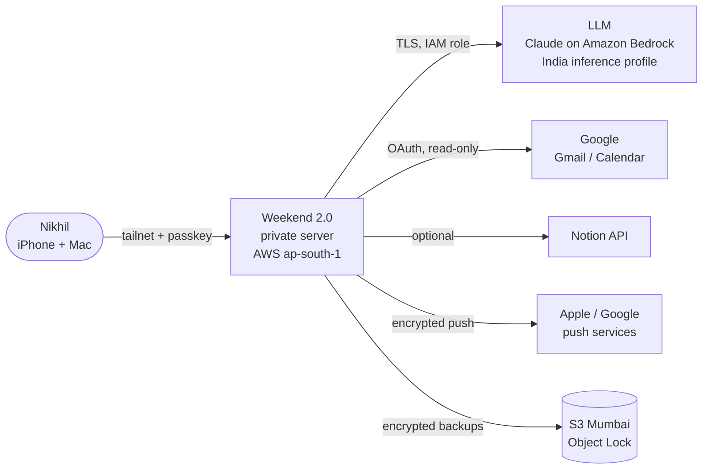
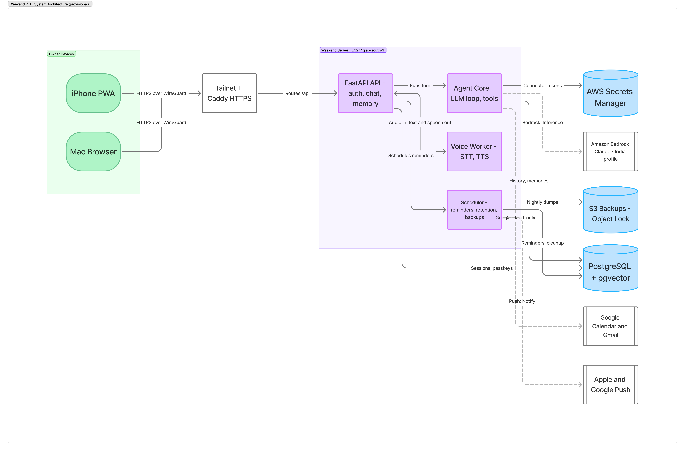
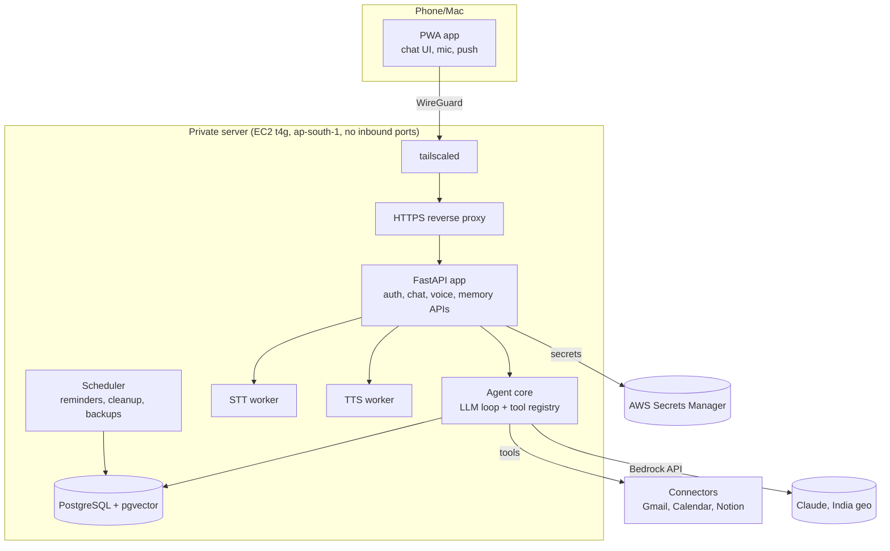
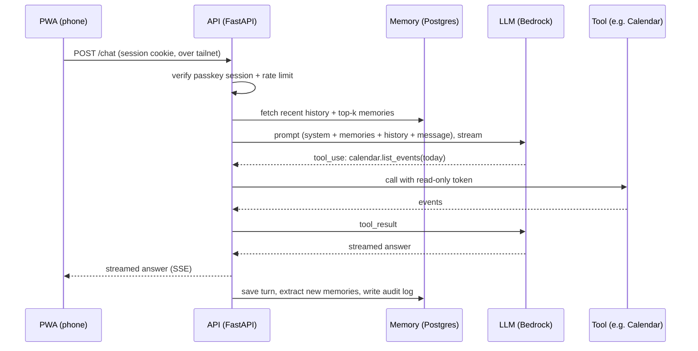
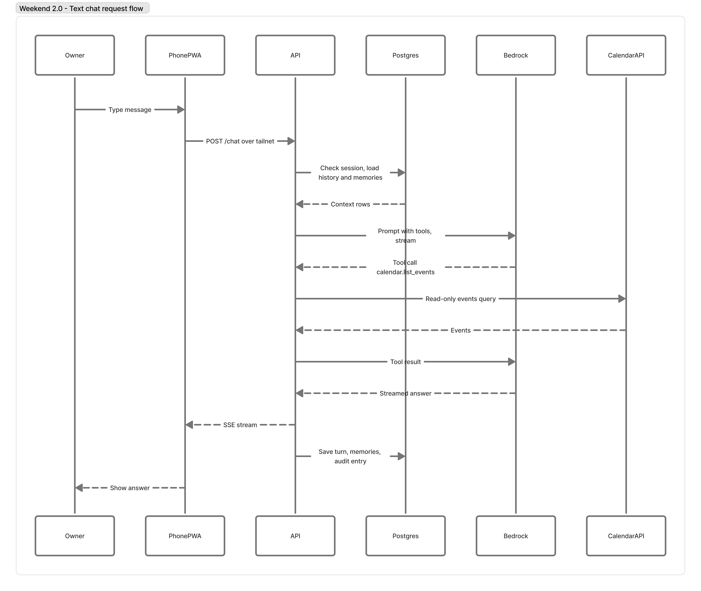
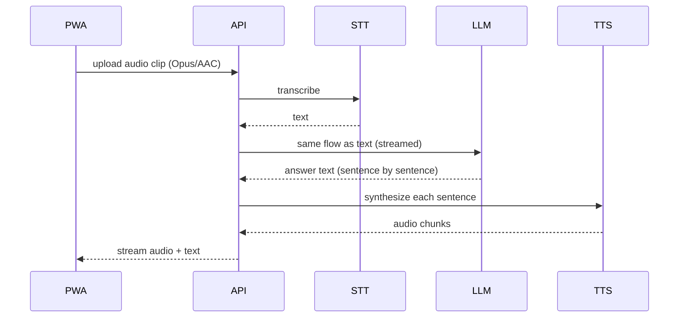
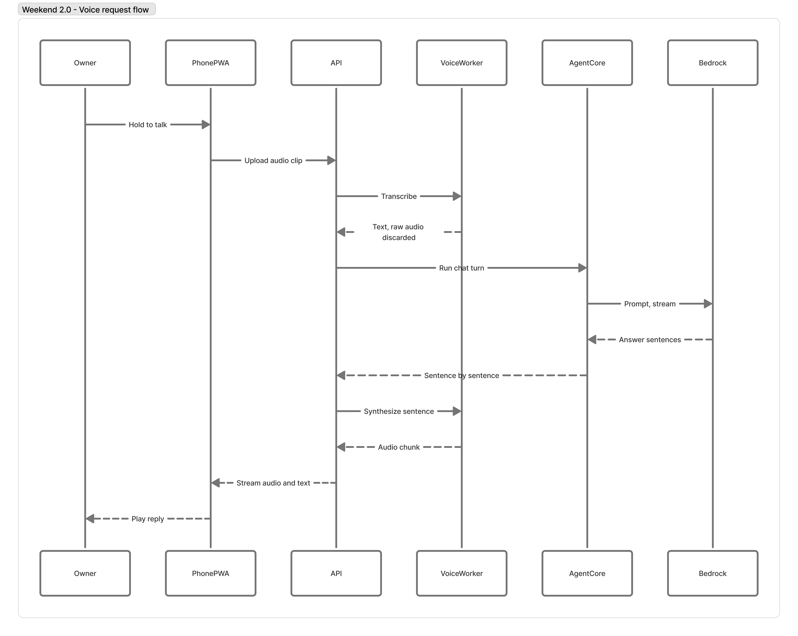
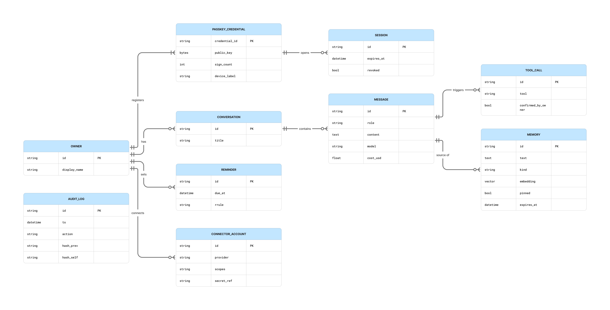
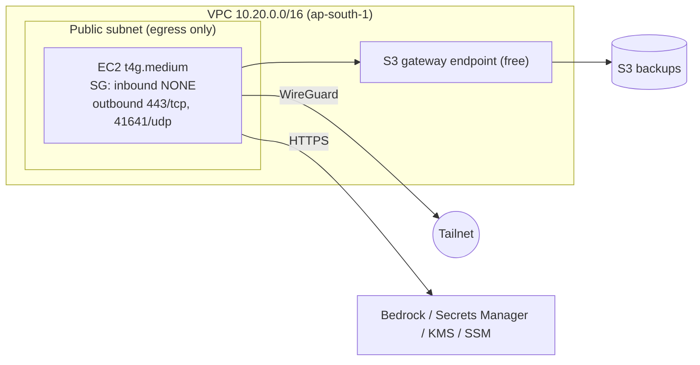
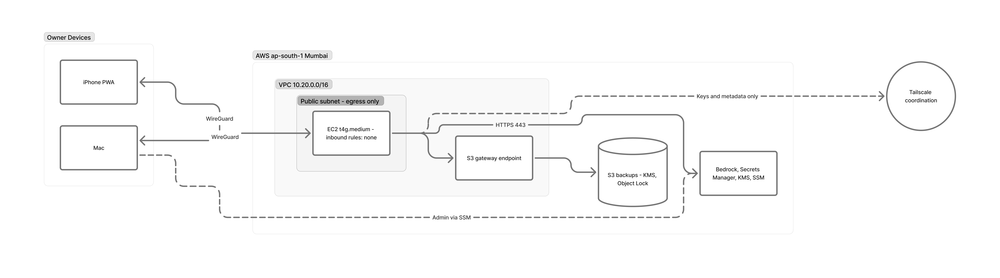

# Weekend 2.0 — Personal AI Assistant: Design Document

> **Doc version:** 0.1.3 (DRAFT) · **Status:** Phase 0 — Requirements & architecture · **Owner:** Nikhil
> **Last updated:** 2026-10-02 (IST) · **Applies to:** prices and versions checked on 2026-10-02
> **Currency:** USD 1 = INR 96.3 (mid-market, 2026-10-02, [Trading Economics](https://tradingeconomics.com/india/currency)). All INR figures are rounded.

Every recommendation in this version is **PROVISIONAL** until the owner decides it. Decisions are made in a fixed order: D1 → D2 → D4 → D5 → D6 → D3 (see §6).

---

## Document release notes

Newest first. Every change to this document adds a row here. Feature releases have their own notes in §23.

| Doc version | Date (IST) | Type | Summary | Sections changed |
|---|---|---|---|---|
| 0.1.3 | 2026-10-02 | Patch | Owner-exported FigJam diagrams added as images (docs/diagrams/: .jpg images, .svg exports, .mmd sources) | 5, 9, 16 |
| 0.1.2 | 2026-10-02 | Patch | FigJam board with 5 architecture diagrams (system, text flow, voice flow, network, data model) | 5 |
| 0.1.1 | 2026-10-02 | Patch | Owner set the budget: ₹5,000/month (Q-1 closed). Budget fit added to cost totals. | 3.1, 21.4, 21.5, 24 |
| 0.1.0 | 2026-10-02 | Initial draft | Base plan: architecture, component designs, cost model, roadmap. All decisions open. | All |

**How to update this document**
1. Change only the sections you need. Bump the version: **major** for an architecture change or a new decision, **minor** for a new feature section or major content, **patch** for fixes and price refreshes.
2. Add a row to the table above.
3. When a feature ships, add an entry to §23 and update that component's *Change history* table.
4. Re-check every price older than 90 days before you rely on it. Each cost row carries its own "checked on" date.

---

## Contents

- **Part A — Read me first:** 1 What it is · 2 Glossary · 3 Goals and sizing · 4 Privacy rules in plain words
- **Part B — Architecture:** 5 System overview · 6 Decisions register
- **Part C — Components:** 7 Chat assistant · 8 Voice · 9 Database and storage · 10 Query, memory and retrieval · 11 SMS and messaging · 12 Connectors · 13 Plugins and tools · 14 Authentication and access · 15 Mobile interface
- **Part D — Platform:** 16 Infrastructure · 17 Servers and compute · 18 CI/CD · 19 Monitoring, audit and backups · 20 Threat model
- **Part E — Cost:** 21 Cost model
- **Part F — Delivery:** 22 Roadmap · 23 Feature release notes · 24 Open questions and risks
- **Appendices:** A Lessons from Weekend v1 · B Component template · C Sources

---

# PART A — READ ME FIRST

## 1. What Weekend 2.0 is

**In one sentence:** a private AI assistant, like a personal ChatGPT, that only Nikhil can use. It answers by text or voice from his phone or Mac, remembers what he tells it, and can read his email and calendar when he allows it. His data stays under his control and inside India wherever possible.

**A day in the life (target experience)**
- **07:30** — On the phone, Nikhil taps the Weekend app (an icon on the home screen) and says: *"What's on my calendar today, and did AWS send any billing alerts?"* Weekend turns his speech into text, checks the calendar and Gmail connectors, and answers out loud in about 3 seconds.
- **13:00** — He types: *"Remember that the staging DB password rotates on the 15th."* Weekend stores a **memory**. It stores the fact, not the password itself: secrets never go into memory.
- **18:00** — He gets a notification: *"Reminder: staging DB rotation is in 2 days."*
- **22:00** — On the Mac he asks: *"Summarise what I worked on this week."* Weekend searches its own memory and conversation history and writes a summary.

**What it is not**
- Not a product for other people: there is no sign-up page and no second user.
- Not an autonomous agent that acts on its own. Anything that changes something (sending email, deleting data) asks Nikhil first.
- Not a place to store passwords or keys. Secrets live in a secrets manager (P4).

**How the pieces fit, in plain words**
Think of Weekend as a small private office:
- The **front door** is the phone app. Only Nikhil's devices have a key: a private network called a *tailnet*, plus a *passkey*.
- The **receptionist** is the *API server*. It checks who is at the door and passes the request on.
- The **brain** is a large language model (LLM). It reads the request and decides what to answer or which tool to use.
- The **filing cabinet** is the database. It holds conversations, memories and settings, encrypted.
- The **ears and mouth** are speech-to-text and text-to-speech.
- The **assistants with keys to other rooms** are *connectors* and *tools*: Gmail, Calendar and so on. Each one has the narrowest key that works.

---

## 2. Glossary

| Term | Plain meaning | Where it matters |
|---|---|---|
| **LLM** (large language model) | The AI "brain" that reads text and writes answers, for example Claude or Gemini. | §7 |
| **Token** | A piece of a word; about 4 English characters. LLMs are priced per million tokens (MTok). | §21 |
| **Context / context window** | Everything the LLM sees in one request: instructions, history, retrieved memories. | §7, §10 |
| **Prompt caching** | Re-using an unchanged start of a prompt so it is billed at about 10% of the normal input price. | §21 |
| **Tool calling / function calling** | The LLM asks *your code* to run a named function (such as `calendar.list_events`) and uses the result. | §7, §13 |
| **Agent loop** | Repeat until done: the LLM thinks, calls tools, reads the results, then answers. | §7 |
| **STT** (speech-to-text) | Turns audio into text, for example Whisper or Amazon Transcribe. | §8 |
| **TTS** (text-to-speech) | Turns text into spoken audio, for example Kokoro or Amazon Polly. | §8 |
| **Embedding** | A list of numbers that represents the *meaning* of a text. Similar meanings give similar numbers. | §10 |
| **Vector search / pgvector** | Finding stored texts whose embeddings are closest to the question's embedding. pgvector adds this to PostgreSQL. | §9, §10 |
| **RAG** (retrieval-augmented generation) | Search memory first, then give the best matches to the LLM so it answers with your facts. | §10 |
| **Connector** | Code that reads from (or writes to) an outside service, such as Gmail, using OAuth. | §12 |
| **OAuth scope** | The exact permission a connector asks for, for example "read calendar" but not "delete calendar". | §12 |
| **Plugin / tool** | A capability the agent can use. In Weekend 2.0, tools are fixed, reviewed code. Nothing is downloaded at runtime. | §13 |
| **Passkey (WebAuthn)** | Password-less login tied to your device and its Face ID or Touch ID. It can't be phished. | §14 |
| **Tailnet / Tailscale** | A private WireGuard network between your own devices. The server has no public door. | §14, §16 |
| **PWA** (progressive web app) | A website you "Add to Home Screen" that behaves like an app, including notifications. | §15 |
| **KMS / CMK** | Key Management Service / customer-managed key: the encryption key you control. | §9 |
| **IaC / Terraform** | Infrastructure as code: cloud resources described in files and created repeatably. | §16 |
| **DLT** (India) | TRAI's mandatory registry for anyone sending commercial SMS in India. | §11 |
| **P1–P10** | The project's ten privacy rules (§4). | everywhere |
| **D1–D6** | The six big decisions (§6). | everywhere |
| **🔓 data exit** | A point where data leaves the owner's control, for example a hosted LLM API. | §5, §21 |

---

## 3. Goals, non-goals and sizing

### 3.1 Goals
| # | Goal | Measure |
|---|---|---|
| G1 | Chat with the assistant from phone and Mac, any time | Works on iPhone/Android PWA and Mac browser |
| G2 | Voice in and voice out | Speech round trip ≤ 3 s at p50 (target) |
| G3 | It remembers what the owner tells it, and can forget it | Owner can view, export and delete any memory (P6) |
| G4 | Read-only access to the owner's email and calendar | Connectors with minimum scopes |
| G5 | Only the owner can use it | P1 tests pass; no public unauthenticated endpoint |
| G6 | Low, predictable cost | Monthly cost ≤ **₹5,000 (≈ USD 52)**, with budget alerts |
| G7 | Data stays in India where possible | Every exit flagged 🔓 and approved |

### 3.2 Non-goals (v1 of Weekend 2.0)
Multi-user accounts · public website · marketplace plugins · autonomous actions without confirmation · SMS marketing · voice cloning of real people.

### 3.3 Sizing for one person
These are **assumptions to confirm** (Q-2). They drive every cost and server number below.

| Dimension | Low | Expected | Heavy |
|---|---|---|---|
| Chat turns per day | 30 | 100 | 300 |
| Input tokens per turn (instructions + history + memories) | 3,000 | 3,000 | 3,000 |
| Output tokens per turn | 400 | 400 | 400 |
| Voice minutes per day (talking + listening) | 5 | 30 | 90 |
| Concurrent users | 1 | 1 | 1 |
| Peak requests per second | < 1 | < 1 | ~ 2 |
| Data growth in year 1 | < 1 GB | ~ 2 GB | ~ 5 GB |
| Availability target | Best effort | 99% per month (about 7 h downtime allowed) | 99% |

**What this means:** one person never needs auto-scaling clusters, Kubernetes or multi-region failover. One small server, or serverless functions, is enough. The main cost driver is the LLM, not the servers.

---

## 4. Privacy rules in plain words (P1–P10)

| # | Rule | In plain words | How Weekend 2.0 meets it (planned) |
|---|---|---|---|
| P1 | Single-owner access | Only Nikhil's devices and face or finger can get in. | Tailnet (device layer) + passkey (person layer); no public port |
| P2 | TLS 1.2+ everywhere | Everything travelling over a network is encrypted. | WireGuard on the tailnet + HTTPS; TLS to AWS APIs |
| P3 | Encrypted storage | Data on disk is unreadable without your key. | EBS, S3 and backups encrypted with a customer-managed KMS key |
| P4 | Secrets in a manager | No passwords or API keys in code or files. | AWS Secrets Manager; IAM role, no access keys |
| P5 | Keep only what's needed | Delete old data automatically. | Retention table (§9.4) with scheduled cleanup |
| P6 | View, export, delete | You can see everything, download it, and wipe it. | `/export` and `/delete` endpoints plus a runbook, tested |
| P7 | Flag data exits | Know every place data leaves your control. | 🔓 flags in every section and in §5.4 |
| P8 | Tamper-resistant logs | A record of who did what, which can't be quietly edited. | Append-only audit table + S3 Object Lock copy |
| P9 | Small attack surface | As few open doors as possible. | Zero inbound security-group rules; tailnet only |
| P10 | Encrypted, tested backups | Backups exist and a restore has actually been tried. | Nightly encrypted dump to S3; quarterly restore drill |

---

# PART B — ARCHITECTURE

## 5. System overview

> **Editable diagrams (FigJam):** https://www.figma.com/board/pMvZioGximavxDcsD14Ee9 — the Mermaid diagrams are the source of truth (also kept as `.mmd` files in `docs/diagrams/`); the `.jpg`/`.svg` images there are exports of the board. Re-export them when the board changes.

> This shows the **PROVISIONAL reference design** (Option B in §17: a private server in AWS Mumbai, reached only over the tailnet). If the owner picks a different D1 option, these diagrams change. §17 shows the alternatives.

### 5.1 Context: who talks to what




### 5.2 Containers: what runs on the server


### 5.3 How a request flows

**Text message**




**Voice message** (push-to-talk)




**Latency budget for voice (target, p50):** upload 0.2 s + STT 0.6 s + first LLM sentence 1.2 s + first TTS chunk 0.4 s + network 0.2 s ≈ **2.6 s** until the first sound. These are design targets, measured in Phase 2. `Not verified`.

### 5.4 Data-exit map (P7)
| # | Exit | Data | To | Default |
|---|---|---|---|---|
| X1 | LLM inference | Prompts, history, memories, tool results | AWS Bedrock, India geo profile (Mumbai/Hyderabad) | Needed. 🔓 flagged in §7 |
| X2 | Hosted STT/TTS (if chosen) | Voice audio, spoken text | AWS Transcribe/Polly Mumbai, or none if local | Decided in Phase 2 (§8) |
| X3 | Push notifications | Encrypted payload + metadata | Apple APNs / Google FCM | Content-free notifications by default (§11) |
| X4 | Tailscale coordination | Device keys, device names, IPs (not traffic) | Tailscale Inc. (or self-hosted Headscale) | 🔓 flagged in §14 |
| X5 | Connectors | Queries to Google/Notion | Google, Notion | Read-only, approved one by one |
| X6 | HTTPS certificates | Machine name in public CT logs | Let's Encrypt CT logs | Use a non-identifying machine name |
| X7 | Research / web tools | Search queries | Search provider | Off by default |
| X8 | Design diagrams | Architecture design only (no secrets or personal data) | Figma Inc. | Approved by owner 2026-10-02 |

---

## 6. Decisions register (D1–D6)

**Order is strict:** D1 → D2 → D4 → D5 → D6 → D3. Later decisions stay `PROVISIONAL — depends on D#` until the earlier ones are decided. Each decision gets an ADR in `docs/adr/`.

| ID | Decision | Options | PROVISIONAL recommendation | Status | Details |
|---|---|---|---|---|---|
| D1 | Hosting | Serverless · Private server (cloud) · Local (Mac at home) · Hybrid | **Private server in AWS ap-south-1, tailnet-only** | Open | §17 |
| D2 | AI model | Claude via Bedrock India · Claude API (global) · Gemini · open-weights local | **Claude Haiku 4.5 (default) + Sonnet 5 (hard tasks) via Bedrock `in.` profiles** | Open — depends on D1 | §7 |
| D4 | Cloud provider | AWS · GCP · none | **AWS** (Bedrock India inference + owner's expertise) | Open — depends on D1, D2 | §16 |
| D5 | Storage / hardware | Postgres on server · RDS · DynamoDB · local disk | **PostgreSQL 17 + pgvector on the server's encrypted EBS; S3 for backups** | Open — depends on D1, D4 | §9 |
| D6 | Authentication | Passkey · passkey + tailnet · OIDC (Google) · mTLS | **Tailnet (device) + passkey (person)**, recovery codes offline | Open — depends on D1 | §14 |
| D3 | Mobile interface | PWA · native app · messaging bridge (Telegram/WhatsApp) · voice-only | **PWA** | Open — decided last | §15 |

---

# PART C — COMPONENTS

> Each component uses the same template (Appendix B), so features can be added one at a time.

## 7. Chat assistant (agent core)

**Status:** ⚪ Design · **Phase:** 1 · **Decision:** D2

### 7.1 Plain-English summary
The chat assistant is the "brain plus manager". It takes your message, gathers the relevant context (recent chat, memories), asks the LLM for an answer, lets the LLM use approved tools, and streams the answer back.

### 7.2 How it works
1. **Build the context:** system instructions (who Weekend is, its rules) + up to 8 retrieved memories (§10) + the last N turns + your message.
2. **Pick a model (routing):** simple requests go to a fast, cheap model. Long or complex reasoning goes to a stronger model. Start with a rule-based router (message length, keywords, "think harder" toggle) and move to LLM-based classification only if needed.
3. **Agent loop:** the LLM may return `tool_use`. The server runs the tool from the allow-list (§13) and sends back `tool_result`. Maximum 5 tool steps per turn.
4. **Confirmation gate:** any tool marked `writes=true` (send email, create event) **pauses** and asks you "Do it? yes/no" in the app.
5. **Stream** the answer to the app with Server-Sent Events.
6. **After the turn:** save it, extract candidate memories (§10), write an audit entry (§19).

**Tech (PROVISIONAL):** Python 3.12, FastAPI, the official `anthropic` SDK's Bedrock client (`AnthropicBedrock`), Pydantic v2, SQLAlchemy 2.x. Pinned versions go into `requirements.txt` in Phase 1.

### 7.3 Model options (D2)
Prices are per million tokens (input / output), checked 2026-10-02 on [Anthropic pricing](https://platform.claude.com/docs/en/about-claude/pricing).

| Option | Model(s) | Price USD | Data location | Pros | Cons | P7 |
|---|---|---|---|---|---|---|
| **A. Claude on Bedrock, India geo profile** | Haiku 4.5, Sonnet 5, Opus 5 (`in.anthropic.*`) | Haiku $1/$5 · Sonnet 5 $2/$10 · Opus 5 $5/$25, **+10% regional premium** | Processed in ap-south-1/ap-south-2; not stored ([AWS blog, 2026-09-29](https://aws.amazon.com/blogs/machine-learning/amazon-bedrock-expands-claude-model-availability-to-india-cross-region-inference/)) | Data stays in India; IAM role, no API key (P4); one AWS bill | Newest models (Sonnet 5.5, Opus 5.5) are not in the India profile yet | 🔓 to AWS (India) |
| B. Claude API (Anthropic, global) | Sonnet 5.5 $2/$10, Opus 5.5 $4/$20, Haiku 4.5 $1/$5 | Standard | Global routing (US-only option at 1.1×; no India option) | Newest models first; prompt caching | Data leaves India; API key to manage | 🔓 to Anthropic (global) |
| C. Gemini API | 2.5 Flash-Lite $0.10/$0.40 · 2.5 Flash $0.30/$2.50 · 3.1 Pro $2/$12 ([third-party summary](https://benchlm.ai/google/api-pricing), `Not verified` on Google's page) | Cheapest | Vertex regional options — `Not verified` for asia-south1 | Very cheap | Second cloud vendor; check data-use terms | 🔓 to Google |
| D. Open-weights, local | e.g. Qwen3 14B, Gemma 4 26B A4B (Apache 2.0, per [HF blog](https://huggingface.co/blog/daya-shankar/open-source-llm-models-to-run-locally)) via Ollama | $0 per token | Your hardware | Maximum privacy | Weaker than frontier models; needs a 24–32 GB Mac or a GPU; hardware disclosure (§17.3) | None |

**PROVISIONAL recommendation:** Option A. Haiku 4.5 handles about 80% of turns, Sonnet 5 about 20%, and Opus 5 only on explicit request. Keep the LLM client behind an interface (`LLMProvider`) so B or D can be swapped in later.

**Price conflict to resolve:** Anthropic states Sonnet 5's $2/$10 is now standard on the Claude API. A third-party source says Bedrock's Sonnet 5 rose to $3/$15 after 2026-08-31 ([CloudZero](https://www.cloudzero.com/blog/amazon-bedrock-pricing/)). Bedrock sets its own prices, so **check [aws.amazon.com/bedrock/pricing](https://aws.amazon.com/bedrock/pricing/) before deciding D2.** `Not verified`.

**Tokenizer note:** Claude 4.7 and later models use a tokenizer that produces about 30% more tokens for the same text (Anthropic pricing page). The cost model in §21 adds this for Sonnet 5.

### 7.4 Data held, retention, exits
- Held: conversation turns (text), model and token counts per turn, tool calls.
- Retention: conversations 365 days by default (owner-configurable); token and cost metrics 2 years.
- 🔓 **DATA LEAVES OWNER CONTROL**
  - **What:** prompts (message, retrieved memories, recent history, tool results)
  - **To:** AWS Bedrock, India geographic cross-region inference (ap-south-1 / ap-south-2)
  - **Why:** LLM inference
  - **Policy:** AWS states customer data is not stored in the destination Region for cross-Region inference ([AWS blog](https://aws.amazon.com/blogs/machine-learning/amazon-bedrock-expands-claude-model-availability-to-india-cross-region-inference/)). Bedrock's model-training policy: `Not verified` — check the Bedrock data-protection docs.
  - **Alternative:** open-weights model running locally (Option D)

### 7.5 Security
- Prompt-injection defence: tool results and connector content are wrapped as *data*, never as instructions. Write-tools always require confirmation.
- Output limits: maximum tokens per turn, maximum tool steps, daily cost cap (stop and notify when exceeded).

### 7.6 Cost
See §21. Expected about **USD 16 / ₹1,530 per month** for the LLM.

### 7.7 Open questions
Q-3: languages: English only, or Hindi/Hinglish too? This affects model and STT choice.

### 7.8 Change history
| Version | Date | Change |
|---|---|---|
| 0.1.0 | 2026-10-02 | Initial design |

---

## 8. Voice (speech-to-text and text-to-speech)

**Status:** ⚪ Design · **Phase:** 2 · **Decision:** part of D2/D5

### 8.1 Plain-English summary
"Ears" (STT) turn your speech into text. "Mouth" (TTS) reads the answer back to you. v1 uses **push-to-talk**: hold the button and speak. An always-listening wake word is a later feature, because it costs battery and privacy.

### 8.2 How it works
1. The PWA records audio (Opus in WebM on Android/desktop, AAC/MP4 on iOS) and uploads it when you release the button.
2. The STT engine returns text, with the language detected.
3. The text goes through the normal chat flow (§7).
4. The answer streams back sentence by sentence. Each sentence is sent to TTS and played as soon as it's ready.

### 8.3 Options
| Option | STT | TTS | Cost at 900 min/month | Data location | Licence | Notes |
|---|---|---|---|---|---|---|
| **A. Local on the server** | faster-whisper (CTranslate2 Whisper; Whisper is MIT) | Kokoro 82M (Apache 2.0) | $0 per minute; needs more CPU/RAM (t4g.large instead of medium: +~$16/month) | Your server | MIT / Apache 2.0 | Most private; CPU latency `Not verified`, benchmark in Phase 2 |
| **B. AWS managed, Mumbai** | Amazon Transcribe ($0.024/min, **15 s minimum per request**) | Amazon Polly Neural ($16 per 1M characters) | ≈ $21.6 + ≈ $10 = **~$32 (₹3,080)** ([Transcribe](https://costgoat.com/pricing/amazon-transcribe), [Polly](https://texttolab.com/blog/amazon-polly-pricing); regional uplift `Not verified`) | AWS Mumbai | Service terms | Simple; the 15 s minimum makes short commands expensive |
| C. Google Cloud | Chirp 3 (~$0.016/min) | Cloud TTS | ≈ $15 + TTS | Google (region `Not verified`) | Service terms | Second cloud vendor |
| D. ElevenLabs (evaluation only) | — | Premium voices | Credits | Vendor (`Not verified`) | Vendor terms | Phase 2 trial only, with approval per call |

**Other notes**
- **STT state of the art (2026):** Qwen3-ASR (multilingual), NVIDIA Parakeet TDT (English streaming), Whisper large-v3-turbo (809M parameters, close to large-v3 accuracy) ([Northflank](https://northflank.com/blog/best-open-source-speech-to-text-stt-model-in-2026-benchmarks), [SevenLabs](https://www.sevenlabs.site/blogs/best-open-source-speech-to-text-models-2026)). Whisper handles Indian-accented English and Hindi reasonably well; prompting with names and terms improves accuracy.
- ⚖️ **LICENCE:** **Piper TTS** moved to `OHF-Voice/piper1-gpl` under **GPL-3.0** (the old MIT repository was archived on 2025-10-06) ([source](https://www.cekura.ai/discover/piper-tts)). Prefer **Kokoro (Apache 2.0)**. Avoid Coqui XTTS (CPML, non-commercial).

**PROVISIONAL recommendation:** start Phase 2 with **A (local)**. Benchmark latency on the chosen server. If p50 is over 3 s, use **B for STT only** and keep TTS local.

### 8.4 Data held, retention, exits
- Raw audio: **not stored** by default (deleted after transcription). An optional debug flag keeps it for 24 h.
- Transcripts are stored as normal chat turns (§7.4).
- Option B/C → 🔓 flag (voice audio to AWS or Google).

### 8.5 Change history
| Version | Date | Change |
|---|---|---|
| 0.1.0 | 2026-10-02 | Initial design |

---

## 9. Database and storage

**Status:** ⚪ Design · **Phase:** 1 and 3 · **Decision:** D5

### 9.1 Plain-English summary
One database, PostgreSQL, holds everything structured. The **pgvector** extension lets the same database run "meaning search" for memories. Files (backups, exports) go to S3. Everything is encrypted with a key you control.

### 9.2 Options
| Option | Monthly cost (ap-south-1) | Pros | Cons |
|---|---|---|---|
| **A. PostgreSQL 17 + pgvector on the server's EBS volume** | Included in the server; EBS gp3 40 GB ≈ $3.6 (`Not verified` Mumbai rate) | Cheapest; one box; full control | You run backups and upgrades (Ansible) |
| B. Amazon RDS PostgreSQL db.t4g.micro | ≈ $15–28 + storage (sources conflict: [Bytebase](https://www.bytebase.com/dbcost/rds-pricing/), [Economize](https://www.economize.cloud/resources/aws/pricing/rds/db.t4g.micro/)) | Managed backups and patching | More cost for one user; another network hop |
| C. DynamoDB + a separate vector store | Cents | Serverless | No SQL joins; vector search needs another service |
| D. SQLite + sqlite-vec on a local Mac | $0 | Simplest local option | Only fits D1 = local |

**pgvector:** latest v0.8.6, published 2026-07-29 ([PyPI/GitHub release tracker](https://releasealert.dev/github/pgvector/pgvector)). Pin it in Phase 1.

**PROVISIONAL recommendation:** A. Revisit B if backups or patching become a burden.

### 9.3 Data model (first draft)
| Table | Purpose | Key columns |
|---|---|---|
| `owner` | The single owner record (exactly one row, enforced) | id, display_name, created_at |
| `passkey_credential` | Registered passkeys (public keys only) | id, credential_id, public_key, sign_count, device_label, created_at, last_used_at |
| `session` | Login sessions | id, credential_id, created_at, expires_at, revoked |
| `conversation` | A chat thread | id, title, created_at, archived |
| `message` | One turn | id, conversation_id, role, content, model, tokens_in, tokens_out, cost_usd, created_at |
| `memory` | A remembered fact | id, text, kind (fact/preference/task), source_message_id, embedding vector(N), created_at, expires_at, pinned |
| `reminder` | Scheduled notification | id, text, due_at, recurrence (RRULE), status |
| `connector_account` | Connected services (no tokens here) | id, provider, scopes, secret_ref (Secrets Manager ARN placeholder), status |
| `tool_call` | Tool usage log | id, message_id, tool, args_redacted, result_size, confirmed_by_owner, created_at |
| `audit_log` | Append-only security log (§19) | id, ts, actor, action, target, hash_prev, hash_self |



### 9.4 Retention (P5)
| Data | Default retention | Deletion |
|---|---|---|
| Messages | 365 days | Nightly job; owner can delete any time |
| Memories | Until deleted (pinned) or 180 days if unpinned and unused | Nightly job |
| Raw audio | 0 (not stored) | — |
| Tool-call logs | 90 days | Nightly job |
| Audit log | 2 years (immutable copy in S3 Object Lock) | Expires by lifecycle rule |
| Backups | 35 daily + 12 monthly | S3 lifecycle |

### 9.5 Encryption (P3)
- EBS volume and snapshots: KMS customer-managed key `alias/weekend-data`.
- S3 backups: SSE-KMS with the same key family; bucket blocks public access; Object Lock (governance mode) for audit copies.
- Column-level: not needed in v1, because the disk is encrypted and the server is single-tenant. Revisit in the Phase 4 threat model.

### 9.6 Change history
| Version | Date | Change |
|---|---|---|
| 0.1.0 | 2026-10-02 | Initial design |

---

## 10. Query, memory and retrieval

**Status:** ⚪ Design · **Phase:** 3

### 10.1 Plain-English summary
This is how Weekend "remembers" and "looks things up". When you say something worth keeping, it saves a short **memory**. When you ask a question, it searches memories and past chats by *meaning* (not just keywords) and gives the best matches to the LLM.

### 10.2 How it works
1. **Write path:** after each turn, a cheap LLM call (Haiku) proposes 0–3 memories: "Owner's staging DB rotates on the 15th". Memories are shown in the app; the owner can edit, pin or delete them. Secrets are filtered out by regex and an LLM check before saving.
2. **Embedding:** each memory is turned into a vector by a **local embedding model** on the server, so no data leaves. The model choice is made in Phase 3 (candidates: small BGE or E5 models; licence check required, `Not verified`).
3. **Read path (hybrid search):** pgvector similarity (HNSW index) + PostgreSQL full-text search, merged by rank. Top 8 go into the prompt.
4. **Owner queries:** "What do you know about X?", "Forget everything about Y", "Export my data". These map to tools `memory.search`, `memory.delete`, `data.export`.

### 10.3 Data exits
Embeddings are computed locally, so there is no exit. The retrieved memories are sent to the LLM as part of X1 (§5.4).

### 10.4 Change history
| Version | Date | Change |
|---|---|---|
| 0.1.0 | 2026-10-02 | Initial design |

---

## 11. SMS and messaging (notifications)

**Status:** ⚪ Design · **Phase:** 2 (notifications) · **Decision:** affects D3

### 11.1 Plain-English summary
You want Weekend to *reach you*, with reminders and alerts. SMS looks like the obvious channel, but in India it is heavily regulated and isn't private. This section explains why the recommendation is **app push notifications instead of SMS**.

### 11.2 Findings (researched 2026-10-02)
- **India SMS needs DLT registration.** TRAI requires every sender of commercial or transactional SMS to register an **entity** (a business), **sender IDs** and **every message template** on an operator DLT portal before sending. Unregistered messages are blocked by carriers. Sender IDs now carry a category suffix (-P/-T/-S/-G) ([MessageCentral](https://www.messagecentral.com/sms-guideline/india), [SMSCountry](https://www.smscountry.com/blog/dlt-registration/)). **A private individual cannot practically register.**
- **Cost:** about ₹0.12–0.25 per SMS through Indian providers, plus registration fees (for example a ₹5,900 DLT entity fee cited for Gupshup) ([MetaReach](https://metareachmarketing.com/sms-pricing-comparison-india-2026.php), [CodingClave](https://codingclave.com/blog/gupshup-sms-pricing-india-2026)).
- **Privacy:** SMS is not end-to-end encrypted, and the provider sees every message (P2/P7 fail).
- **Reading SMS:** iOS does not let apps read your SMS inbox, so "assistant reads my SMS" is not possible on iPhone.
- **Telegram bot:** bot chats are **not end-to-end encrypted**; Telegram holds the keys ([Telegram FAQ](https://telegram.org/faq)).
- **WhatsApp Cloud API:** needs a Meta business account; utility messages ₹0.115 each + 18% GST outside the 24 h window ([MyOperator](https://myoperator.com/blog/whatsapp-business-api-pricing-india-2026)); content goes to Meta.

### 11.3 Options
| Option | Privacy | Cost | Effort | Verdict |
|---|---|---|---|---|
| **A. Web Push from the PWA** | Payload encrypted end to end (Web Push encryption); Apple/Google see only metadata | $0 | Low | **Recommended** |
| B. SMS via DLT provider | Poor (plain text) | ₹0.12–0.25/SMS + entity registration | High (needs a business entity) | Not recommended |
| C. Telegram bot | Medium (Telegram can read it) | $0 | Low | Only for content-free pings, if ever |
| D. WhatsApp Cloud API | Medium (Meta) | ₹0.115/msg + GST + BSP fees | Medium | Not recommended |
| E. Email to self | Medium | $0 | Low | Fallback for daily digest only |

**iOS note:** Web Push works on iOS 16.4+ **only when the PWA is added to the Home Screen** ([MagicBell](https://www.magicbell.com/blog/pwa-ios-limitations-safari-support-complete-guide)).

**PROVISIONAL recommendation:** A, with **content-free notifications** by default ("You have 1 reminder"; open the app to read it). Email-to-self as a fallback.

### 11.4 Change history
| Version | Date | Change |
|---|---|---|
| 0.1.0 | 2026-10-02 | Initial design — SMS not recommended |

---

## 12. Connectors

**Status:** ⚪ Design · **Phase:** 3+ (one connector per release)

### 12.1 Plain-English summary
Connectors let Weekend read your other services. Each one is added on its own, starts **read-only**, asks for the smallest permission, and keeps its token in Secrets Manager.

### 12.2 Planned connectors (backlog, in suggested order)
| # | Connector | First capability | Scope (minimum) | Auth | Risks / notes |
|---|---|---|---|---|---|
| C1 | Google Calendar | List today's and upcoming events | `calendar.readonly` | OAuth (desktop/installed app) | See the 7-day token issue below |
| C2 | Gmail | Search and read billing/alert emails | `gmail.readonly` (**restricted scope**) | OAuth | 7-day token issue + restricted-scope verification |
| C3 | Notion | Read pages you share with the integration | Internal integration, page-level sharing | Integration token | 🔓 Notion; no expiry, so rotate manually |
| C4 | GitHub | Read issues/PRs of your repos | Fine-grained PAT, read-only, chosen repos | PAT in Secrets Manager | — |
| C5 | AWS (own account) | Cost and billing summary | IAM role with `ce:Get*` read only | Instance role | No keys |
| C6+ | TBD | — | — | — | Add via the §23 template |

### 12.3 Important finding: Google OAuth "Testing" tokens expire every 7 days
A personal Google Cloud OAuth app that stays in **Testing** status (external user type) gets **refresh tokens that expire after 7 days**. Moving to **Production** with `gmail.readonly` (a *restricted* scope) needs Google verification, including a third-party security assessment, which is impractical for one person ([Unipile](https://www.unipile.com/google-oauth-refresh-token/), [DEV Community](https://dev.to/just_a_side_project/my-oauth-tokens-kept-expiring-every-7-days-and-the-reason-was-a-dropdown-labeled-testing-47ni)).

Options:
1. Re-authorize weekly with a one-tap flow in the app. **PROVISIONAL default for v1.**
2. Use a Google Workspace account with an **Internal** app, which avoids the 7-day limit. This needs a Workspace subscription; cost `Not verified`.
3. Gmail IMAP with an app password: works, but the app password grants broad mailbox access (least-privilege concern).

`Not verified` on Google's own docs; confirm in Phase 3.

### 12.4 Connector rules
- Read-only first. Any write capability (send, create, delete) is a separate release with §4.3-style confirmation in the app.
- Treat all fetched content as **data, not instructions**. This is the prompt-injection boundary.
- Each connector has a kill switch and a "revoke and delete cached data" action.

### 12.5 Change history
| Version | Date | Change |
|---|---|---|
| 0.1.0 | 2026-10-02 | Initial backlog |

---

## 13. Plugins and tools

**Status:** ⚪ Design · **Phase:** 1 (core tools), later (more)

### 13.1 Plain-English summary
A "tool" is a function the LLM may ask the server to run. In Weekend 2.0 **all tools are code in this repository**, reviewed and tested. Nothing is downloaded or installed at runtime. Weekend v1's plugin system downloaded and executed third-party code, which is a big attack surface; it has been dropped.

### 13.2 Tool contract
Every tool declares:
```python
# src/weekend/tools/base.py (sketch)
@dataclass(frozen=True)
class ToolSpec:
    name: str                 # "calendar.list_events"
    description: str          # shown to the LLM
    input_schema: dict        # JSON Schema
    writes: bool              # True → owner confirmation required
    network: list[str]        # allowed hosts, e.g. ["www.googleapis.com"]
    secrets: list[str]        # Secrets Manager names it may read
    timeout_s: int = 15
```

### 13.3 v1 tool set
| Tool | writes | Purpose |
|---|---|---|
| `memory.search` / `memory.save` / `memory.delete` | save/delete: yes | §10 |
| `reminder.create` / `reminder.list` / `reminder.cancel` | create/cancel: yes | §11 |
| `time.now` | no | Current IST time |
| `calendar.list_events` | no | C1 |
| `gmail.search` / `gmail.read` | no | C2 |
| `data.export` | no | P6 |

### 13.4 Future: MCP servers
The Model Context Protocol (MCP) can plug external tool servers into an agent. Each MCP server counts as a **plugin**: only vetted, pinned, locally-run servers, each on its own approval. `Not in v1`.

### 13.5 Change history
| Version | Date | Change |
|---|---|---|
| 0.1.0 | 2026-10-02 | Initial design |

---

## 14. Authentication and access (D6)

**Status:** ⚪ Design · **Phase:** 2 · **Decision:** D6

### 14.1 Plain-English summary
Two locks. **Lock 1 (device):** the server is only reachable from devices on your private tailnet, so it can't be found from the internet. **Lock 2 (person):** the app asks for your passkey (Face ID or Touch ID). Both must pass.

### 14.2 Design
- **Network:** Tailscale on the server and your devices. A Tailscale ACL allows only `owner@` devices to reach `tag:weekend:443`. The security group has **zero inbound rules**.
- **App:** WebAuthn passkeys, server-side with Duo's `webauthn` Python library ([duo-labs/py_webauthn](https://github.com/duo-labs/py_webauthn)). ⚠️ Install the package named `webauthn` (Duo), **not** the unrelated `py-webauthn` on PyPI. Version pinned in Phase 2 (`Not verified`).
- **Sessions:** HttpOnly, Secure, SameSite=Strict cookie; 12 h idle timeout, 7 days maximum; revoke from the app.
- **Registration lock:** passkey registration is only allowed with a one-time bootstrap code printed on the server console (via SSM). There's no public sign-up.
- **Recovery:** 2 passkeys (iPhone + Mac) plus 10 one-time recovery codes printed and stored offline. Phone-loss runbook: remove the device from the tailnet, revoke its passkey, rotate sessions.

### 14.3 Options considered
| Option | Pros | Cons |
|---|---|---|
| **Tailnet + passkey** | No public surface; phishing-resistant | Depends on Tailscale coordination (🔓 X4) |
| Passkey only on a public HTTPS endpoint | No VPN app needed | Public surface (P9); needs WAF/rate limiting |
| Google OIDC login | Easy | Google becomes the gatekeeper (P7) |
| mTLS client certificates | Strong | Painful on iOS |

### 14.4 Tailscale facts (checked 2026-10-02)
- Free **Personal** plan: up to 6 users, unlimited user devices, 50 tagged resources (plans reworked 2026-04-08) ([SSD Nodes](https://www.ssdnodes.com/learn/is-tailscale-free-plan-limits), [CostBench](https://costbench.com/software/business-vpn/tailscale/free-plan/)). `Not verified` on tailscale.com/pricing.
- 🔓 **DATA LEAVES OWNER CONTROL**
  - **What:** device public keys, device names, tailnet IPs, connection metadata. Traffic itself is end-to-end WireGuard.
  - **To:** Tailscale Inc.
  - **Why:** coordination and NAT traversal
  - **Policy:** `Not verified`
  - **Alternative:** self-hosted **Headscale** coordination server
- If you enable Tailscale HTTPS certificates, **machine names are published in public Certificate Transparency logs** ([Tailscale docs](https://tailscale.com/docs/how-to/set-up-https-certificates)). Name the server something generic, like `node-a1`, not `nikhil-weekend`.

### 14.5 Change history
| Version | Date | Change |
|---|---|---|
| 0.1.0 | 2026-10-02 | Initial design |

---

## 15. Mobile interface (D3 — decided last)

**Status:** ⚪ Design · **Phase:** 2

| Option | Pros | Cons | P1/P2/P7 |
|---|---|---|---|
| **PWA** (installable web app) | One codebase for iPhone, Android and Mac; push on iOS 16.4+ when installed; no app-store account | Fewer native features (no background audio recording) | Good |
| Native iOS/Android | Best UX, background features | Two codebases or React Native; Apple developer fee (`Not verified`) | Good |
| Messaging bridge (Telegram/WhatsApp) | No app to build | Content passes through Telegram or Meta | Fails P7 by default |
| Voice-only (Siri Shortcut → API) | Hands-free | Limited UI | OK |

**PROVISIONAL recommendation:** PWA (`PROVISIONAL — depends on D1, D6`). Add a Siri Shortcut later as a voice shortcut.

**Planned screens (v1):** Login (passkey) · Chat (text + hold-to-talk) · Memories (list, edit, pin, delete) · Reminders · Connectors (connect, revoke) · Settings (retention, model routing, budget) · Export and delete-all.

---

# PART D — PLATFORM

## 16. Infrastructure (D4)

**Status:** ⚪ Design · **Phase:** 5 (written early, applied with Phase 1)

### 16.1 Cloud choice (PROVISIONAL: AWS)
- **AWS ap-south-1 (Mumbai)**, with ap-south-2 (Hyderabad) as part of the Bedrock India profile.
- Why AWS: Claude can be served with India data residency through Bedrock `in.` profiles (2026-09-29); the owner is an AWS expert; one bill.
- GCP alternative: Cloud Run asia-south1 + Vertex AI. The Cloud Run free tier and region tier for asia-south1 are `Not verified` (sources conflict).

### 16.2 Network design



- No NAT gateway. It would add roughly $30+ a month (`Not verified` Mumbai price) for no benefit to one server. The instance sits in a public subnet with a public IPv4 used **only for outbound traffic**, and its security group allows **no inbound traffic**. Public IPv4 costs about $3.65/month at $0.005/h (`Not verified` for Mumbai).
- Admin access: **SSM Session Manager** only. No SSH key and no port 22.
- Free S3 gateway endpoint for backup traffic. Interface endpoints (~$7+/month each, `Not verified`) are skipped for cost.

### 16.3 Terraform layout
```
infra/
├── modules/
│   ├── network/        # VPC, subnet, route table, S3 gateway endpoint
│   ├── compute/        # EC2, IAM instance profile, SG (no ingress), EBS (KMS)
│   ├── kms/            # CMK + key policy
│   ├── backup/         # S3 bucket (SSE-KMS, Object Lock, lifecycle, block public access)
│   ├── secrets/        # Secrets Manager entries (names only; values set out-of-band)
│   └── budget/         # AWS Budgets alerts (50/80/100%)
└── envs/
    └── prod/           # one environment for one user; dev = local Docker
        ├── main.tf  backend.tf  variables.tf  outputs.tf  versions.tf
```
- Remote state: S3 bucket with versioning + SSE-KMS; native S3 state locking (`use_lockfile`) or DynamoDB (`Not verified` which one to use with the current Terraform version; confirm in Phase 5).
- Tags on everything: `owner`, `project = "personal-ai-agent"`, `env`, `managed_by = "terraform"`.
- Every `apply` is preceded by `plan` and an owner review. Changes to IAM, network or cost trigger a security checkpoint.

### 16.4 Server configuration (Ansible)
Roles: `base` (updates, unattended-upgrades, auditd, time sync IST), `tailscale`, `postgres` (+ pgvector), `app` (systemd units for the API and workers, Caddy), `backup` (pg_dump → S3), `hardening` (CIS-style basics). Run `--check --diff` first; pass `ansible-lint`.

---

## 17. Servers and compute (D1)

### 17.1 Options compared
| Option | What runs where | Monthly infra (USD / INR) | Privacy | Maintenance | Phone access | Fit |
|---|---|---|---|---|---|---|
| **B. Private cloud server** (recommended) | EC2 t4g.medium (2 vCPU, 4 GiB, Mumbai $0.0224/h ([Spare Cores](https://sparecores.com/server/aws/t4g.medium))) running everything | ≈ $30 / ₹2,890 (§21) | High (India, your keys) | Medium (Ansible) | Tailnet | Best balance |
| A. Serverless AWS | Lambda + API Gateway + RDS/DynamoDB | ≈ $25–40 / ₹2,400–3,850 | Medium–High | Low | **Needs a public API endpoint** (P9 risk) | Good, but it adds public surface |
| C. Local Mac at home | Mac mini running everything, plus Tailscale | ≈ $1 power + one-time hardware | Highest | Medium | Tailnet | Cheapest monthly; home power/internet outages |
| D. Hybrid | Mac at home for data + cloud LLM | ≈ $1–3 + LLM | High | Medium | Tailnet | Good if you already own a Mac to keep on 24/7 |

**PROVISIONAL recommendation (D1):** **B.** Reasons: it gives no public ingress; all data stays in India under your KMS key; it uses tools you know well (Terraform + Ansible); the cost is predictable; it has better uptime than a home Mac. Choose **C or D** if you already have a spare Apple-silicon Mac that can run 24/7 and you want the lowest monthly cost.

### 17.2 Instance sizing
| Size | RAM | On-demand Mumbai | Fits |
|---|---|---|---|
| t4g.small | 2 GiB | $0.0112/h ≈ $8.2/month ([Spare Cores](https://sparecores.com/server/aws/t4g.small)) | API + Postgres, **no** local voice |
| **t4g.medium** | 4 GiB | $0.0224/h ≈ $16.4/month | API + Postgres + small embedding model |
| t4g.large | 8 GiB | ≈ $32.7/month (2× medium, `Not verified`) | + local Whisper/Kokoro voice |

Savings Plans or Reserved pricing can cut this further. `Not verified`.

### 17.3 Hardware disclosure (only if D1 = C/D or D2 = local model)
| Item | Value | Source / status |
|---|---|---|
| Mac mini M4 16 GB/512 GB | ₹79,900 (retail listing) | [ApplePriceHunt](https://applepricehunt.com/in/mac-mini-m4-16gb-512gb-silver) — sources conflict (one says the base model is ₹99,900); `Not verified` on apple.com/in |
| Mac mini M4 24 GB/512 GB | ₹90,999 (retail listing) | [ApplePriceHunt](https://applepricehunt.com/in/mac-mini-m4-24gb-512gb-silver), `Not verified` |
| Local LLM that fits 24–32 GB | Qwen3 14B or Gemma 3 12B (Q4); Gemma 4 26B A4B (MoE) | [HF blog](https://huggingface.co/blog/daya-shankar/open-source-llm-models-to-run-locally); tokens/sec `Not verified`, benchmark before buying |
| Disk | Model 8–20 GB + data < 5 GB + backups | Estimate |
| Power | ~10 kWh/month at idle-heavy use ≈ ₹80 | Estimate, `Not verified` |

---

## 18. CI/CD

**Status:** ⚪ Design · **Phase:** 5 (a basic version in Phase 1)

- **GitHub Actions** in a **private** repository.
- Pipeline: `ruff` + `black --check` → `mypy` → `pytest` (unit + integration with a Postgres service container) → build the Docker image (pinned base digest, non-root) → scan (Trivy for image and IaC, `gitleaks` for secrets, `pip-audit` for dependencies, `checkov` + `tflint` for Terraform) → deploy.
- **AWS access via GitHub OIDC**: an IAM role trusted only by `repo:<OWNER>/<REPO>:ref:refs/heads/main`. No access keys in GitHub. (Weekend v1 used a downloaded service-account key; that is not allowed here.)
- **Deploy gate:** a manual approval environment (`production`). Deploy = push the image to ECR, then run an SSM Run Command on the instance: `docker compose pull && up -d`, followed by a health check and automatic rollback to the previous tag on failure.
- Terraform runs from the owner's Mac (plan → review → apply), not from CI, in v1.

---

## 19. Monitoring, audit logs and backups

| Area | Design | P# |
|---|---|---|
| App logs | JSON logs → journald → CloudWatch Logs (7-day retention). Message content is **not** logged, only IDs and sizes. | P5 |
| Metrics | Request latency, LLM tokens and cost per day, STT/TTS latency, disk usage | — |
| Alerts | Budget alerts (AWS Budgets at 50/80/100%); disk > 80%; API down 5 min → email-to-self / push | — |
| Audit log | `audit_log` table with hash chain (each row stores the hash of the previous one) + nightly export to S3 **Object Lock** | P8 |
| Backups | Nightly `pg_dump` (compressed, SSE-KMS) → S3; EBS snapshots weekly; retention per §9.4 | P10 |
| Restore drill | Quarterly: restore the latest dump into a throwaway container, run integrity checks, record the result in Project Memory M7 | P10 |

---

## 20. Threat model (placeholder — Phase 4)
A STRIDE analysis is done in Phase 4. Known top threats so far:
1. **Prompt injection** through email or calendar content → tool misuse. *Mitigations:* data/instruction separation, write-tools need confirmation, allow-listed network per tool.
2. **Phone theft** → *Mitigations:* passkey needs biometrics; revoke device from the tailnet; session revoke.
3. **Leaked credentials in the repo** (happened in v1) → *Mitigations:* `gitleaks` pre-commit + CI, no `.env` committed, Secrets Manager only.
4. **Runaway LLM cost** → *Mitigations:* daily cost cap in code + AWS Budgets.
5. **Supply chain** (malicious package) → *Mitigations:* pinned versions with hashes, `pip-audit`, minimal dependencies.

---

# PART E — COST

## 21. Cost model

**Basis:** prices checked 2026-10-02 · USD 1 = ₹96.3 · region ap-south-1 · sizing from §3.3 · assumes ~50% of input tokens are prompt-cache hits.

### 21.1 LLM (Option A: Bedrock India profile, +10% regional premium)
Routing: 80% of turns on Haiku 4.5 ($1/$5), 20% on Sonnet 5 ($2/$10, plus a 30% tokenizer uplift). Cache reads are charged at 0.1× input.

| Scenario | Turns/month | Haiku 4.5 | Sonnet 5 | +10% premium | **Total USD** | **Total INR** |
|---|---|---|---|---|---|---|
| Low | 900 | $2.63 | $1.71 | $0.43 | **≈ $4.8** | **≈ ₹460** |
| Expected | 3,000 | $8.76 | $5.69 | $1.45 | **≈ $15.9** | **≈ ₹1,530** |
| Heavy | 9,000 | $26.28 | $17.08 | $4.34 | **≈ $47.7** | **≈ ₹4,590** |

How the Expected Haiku figure is calculated: 2,400 turns × 3,000 input tokens = 7.2M tokens. Half are uncached (3.6M × $1 = $3.60) and half are cache reads (3.6M × $0.10 = $0.36). Output is 0.96M × $5 = $4.80. Total **$8.76**.

⚠️ If Bedrock charges Sonnet 5 at $3/$15 (see the §7.3 conflict), Expected rises by about $2.8.

### 21.2 Infrastructure (Option B: private server)
| Item | Basis | USD/month | INR/month | Status |
|---|---|---|---|---|
| EC2 t4g.medium | $0.0224/h × 730 h | 16.35 | 1,575 | Source: Spare Cores |
| EBS gp3 40 GB | ~$0.09/GB-month | 3.60 | 347 | `Not verified` (Mumbai rate) |
| Public IPv4 | $0.005/h × 730 h | 3.65 | 351 | `Not verified` (Mumbai) |
| KMS CMK | 2 keys × $1 | 2.00 | 193 | `Not verified` |
| Secrets Manager | 5 secrets × $0.40 | 2.00 | 193 | `Not verified` |
| S3 backups + Object Lock | ~15 GB + requests | 0.60 | 58 | Estimate |
| EBS snapshots | weekly, incremental | 1.00 | 96 | Estimate |
| CloudWatch Logs | < 1 GB/month | 1.00 | 96 | Estimate |
| Tailscale | Personal plan | 0.00 | 0 | Source: SSD Nodes |
| **Infra subtotal** | | **≈ 30.2** | **≈ ₹2,910** | |

### 21.3 Voice
| Option | Expected (900 min) |
|---|---|
| A. Local (upgrade to t4g.large) | +≈ $16.4 / ₹1,580 (bigger instance) |
| B. Transcribe + Polly Neural | ≈ $31.6 / ₹3,040 |

### 21.4 Monthly totals (Expected scenario)
**Budget: ₹5,000 / month (≈ USD 52).**

| Configuration | USD | INR | Fits budget? |
|---|---|---|---|
| Text only (B + Bedrock) | **≈ 46** | **≈ ₹4,440** | ✅ (≈ ₹560 headroom) |
| Text + local voice (t4g.large) | ≈ 62 | ≈ ₹5,970 | ❌ over by ≈ ₹970 |
| Text + AWS voice | ≈ 78 | ≈ ₹7,480 | ❌ over by ≈ ₹2,480 |
| Local Mac (C) + Bedrock, text only | ≈ 17 + one-time hardware | ≈ ₹1,640 + ₹80k–1L once | ✅ monthly |

**Getting voice under budget (Phase 2 options, to evaluate):**
1. A 1-year Compute Savings Plan or Reserved Instance for t4g.large (discount `Not verified`).
2. Run STT on the phone or Mac (on-device speech recognition) and keep only TTS on the server. Privacy and accuracy `Not verified`.
3. Stop the instance overnight on a schedule (saves about 30% of compute, but no access at night).
4. Smaller models: Whisper `base`/`small` int8 on t4g.medium. Benchmark the latency.

One-time costs: none for B (no purchase). Optional: a domain name (not needed with a tailnet).

### 21.5 Cost controls
AWS Budgets alerts at 50/80/100% of ₹5,000 (≈ $26 / $42 / $52), plus a forecast alert at 100% · in-app daily LLM cap (default ≈ ₹60/day ≈ $0.62) · Haiku-first routing · prompt caching on the system prompt + tools · no NAT gateway · stop the instance when unused (optional schedule) · Savings Plan after 3 months of stable usage.

---

# PART F — DELIVERY

## 22. Roadmap (phases)
| Phase | Name | Scope | Exit criteria | Status |
|---|---|---|---|---|
| 0 | Requirements & architecture | This document, D1–D4 decisions, diagrams, cost | D1–D4 decided; diagram and cost approved | 🟡 In progress |
| 1 | MVP backend | FastAPI + agent core + Postgres; text chat via a test CLI/web page on the Mac; unit tests | Agent answers via the test interface, tests pass | ⚪ |
| 2 | Mobile access | Tailnet, passkeys, PWA, push, voice (benchmark A vs B) | Owner uses it from the phone securely (D6, TLS) | ⚪ |
| 3 | Memory & storage | Memories, retrieval, retention jobs, export/delete, first connector (Calendar) | Encrypted, owner-controlled memory with retention, export, delete | ⚪ |
| 4 | Security hardening | STRIDE, P1–P10 evidence, injection tests | Threat model done; P1–P10 verified in M7 | ⚪ |
| 5 | CI/CD & IaC | All infra in Terraform; full pipeline | Pipelines build, test, deploy | ⚪ |
| 6 | Monitoring & ops | Alerts, backups, restore drill | Restore tested | ⚪ |

## 23. Feature release notes

Each feature gets one entry when it ships. Template:

```markdown
### Weekend <version> — <feature name> — <YYYY-MM-DD IST>
**Component:** §<n> · **Phase:** <n> · **Status:** Released / Beta
**Added:** <what the owner can now do>
**Changed:** <behaviour changes>
**Security / privacy:** <P# affected, new 🔓 exits, approvals (M9 refs)>
**Cost impact:** <+USD / +INR per month>
**How to use:** <1–3 steps>
**Known issues:** <list or "None">
**Rollback:** <exact steps>
```

| Version | Feature | Date | Status |
|---|---|---|---|
| — | *(no features released yet)* | — | — |

## 24. Open questions and risks
| ID | Question / risk | Needed for | Owner action |
|---|---|---|---|
| Q-1 | Monthly budget ceiling | Budgets, D1/D2 | ✅ Closed 2026-10-02: ₹5,000/month |
| R-4 | Voice options exceed the budget on today's prices | Phase 2 | Evaluate the §21.4 options |
| Q-2 | Confirm the sizing assumptions in §3.3 | Cost model | Confirm or adjust |
| Q-3 | Languages: English only, or Hindi/Hinglish too? | D2, voice | Decide |
| Q-4 | Do you have a spare Apple-silicon Mac that can run 24/7? | D1 (options C/D) | Answer |
| Q-5 | Gmail: accept weekly re-auth, or use Workspace? | C2 | Decide in Phase 3 |
| R-1 | Bedrock Sonnet 5 price conflict | Cost | Check the AWS pricing page |
| R-2 | Several Mumbai prices marked `Not verified` | Cost | Refresh with the AWS Pricing Calculator before D1 |
| R-3 | Leaked tokens in the Weekend v1 git history | Security | Rotate, and purge or archive the repo |

---

# APPENDICES

## Appendix A — Lessons from Weekend v1 (what we will not repeat)
| v1 problem | Weekend 2.0 rule |
|---|---|
| `venv/`, test environments and debug dumps committed (193 MB `.git`) | `.gitignore` from day 1; pre-commit size and secret checks |
| Token leaked in `artifacts_env.txt` | `gitleaks` pre-commit + CI; Secrets Manager only |
| Cloud Run `--allow-unauthenticated`, `us-central1` | No public ingress; India regions only |
| Service-account JSON key file | OIDC for CI, instance roles for the server |
| Plugin system downloading and executing code | Fixed in-repo tools only (§13) |
| Multi-user/superuser code in a single-user app | Single-owner model, enforced in the database |
| Two app entrypoints; routers never mounted | One entrypoint; a smoke test that hits every router |
| Dependencies imported but not declared (and the reverse) | Pinned lock file; CI import check |
| Dockerfile copying folders that didn't exist | CI builds the image on every PR |

## Appendix B — Component section template
```markdown
## <n>. <Component name>
**Status:** ⚪/🟡/🟢/🔴 · **Phase:** <n> · **Decision:** <D#>
### <n>.1 Plain-English summary
### <n>.2 How it works (diagram)
### <n>.3 Options (table: option · pros · cons · P1–P10 · cost · effort) + PROVISIONAL recommendation
### <n>.4 Data held, retention, 🔓 exits
### <n>.5 Security
### <n>.6 Cost
### <n>.7 Open questions
### <n>.8 Change history
```

## Appendix C — Sources (accessed 2026-10-02)
**Rank 1 — official docs and vendor pages**
- Anthropic pricing: https://platform.claude.com/docs/en/about-claude/pricing
- AWS blog, Claude India cross-region inference (2026-09-29): https://aws.amazon.com/blogs/machine-learning/amazon-bedrock-expands-claude-model-availability-to-india-cross-region-inference/
- Bedrock model/region availability: https://docs.aws.amazon.com/bedrock/latest/userguide/models-region-compatibility.html
- Tailscale HTTPS certificates: https://tailscale.com/docs/how-to/set-up-https-certificates
- Telegram FAQ: https://telegram.org/faq
- Duo py_webauthn: https://github.com/duo-labs/py_webauthn

**Rank 3–4 — third-party (cross-check before relying on them)**
- Gemini pricing summary: https://benchlm.ai/google/api-pricing
- Bedrock pricing commentary: https://www.cloudzero.com/blog/amazon-bedrock-pricing/
- EC2 t4g prices (Mumbai): https://sparecores.com/server/aws/t4g.small · https://sparecores.com/server/aws/t4g.medium
- RDS t4g.micro: https://www.bytebase.com/dbcost/rds-pricing/ · https://www.economize.cloud/resources/aws/pricing/rds/db.t4g.micro/
- Transcribe pricing: https://costgoat.com/pricing/amazon-transcribe · Polly: https://texttolab.com/blog/amazon-polly-pricing
- Open-source STT 2026: https://northflank.com/blog/best-open-source-speech-to-text-stt-model-in-2026-benchmarks · https://www.sevenlabs.site/blogs/best-open-source-speech-to-text-models-2026
- Open-source TTS 2026: https://www.bentoml.com/blog/exploring-the-world-of-open-source-text-to-speech-models · Piper licence: https://www.cekura.ai/discover/piper-tts
- Local LLMs 2026: https://huggingface.co/blog/daya-shankar/open-source-llm-models-to-run-locally
- India DLT/SMS: https://www.messagecentral.com/sms-guideline/india · https://www.smscountry.com/blog/dlt-registration/ · https://metareachmarketing.com/sms-pricing-comparison-india-2026.php
- WhatsApp API India: https://myoperator.com/blog/whatsapp-business-api-pricing-india-2026
- Google OAuth 7-day tokens: https://www.unipile.com/google-oauth-refresh-token/
- iOS PWA push: https://www.magicbell.com/blog/pwa-ios-limitations-safari-support-complete-guide
- Tailscale plans: https://www.ssdnodes.com/learn/is-tailscale-free-plan-limits
- pgvector releases: https://releasealert.dev/github/pgvector/pgvector
- Mac mini India prices: https://applepricehunt.com/in/mac-mini-m4-16gb-512gb-silver
- USD/INR: https://tradingeconomics.com/india/currency
